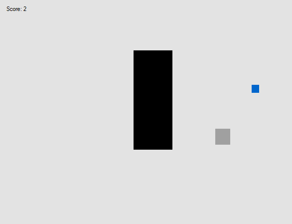

# Idee / Konzept
Mit dem 'GameMaster' wollen wir ein Tool entwickeln, dass es jedem ohne technisches Vorwissen ermöglicht, eine KI oder eher einen Bot zu entwickeln, die für den Nutzern das Spielen von Computer- und Browsergames übernimmt.
Es sollte dafür eine grafische Oberfläche gegen, mit der dann anhand von Parametern die Funktionsweise geändert werden kann.

# Die Anwendung

## Der Startbildschirm


Startet man den 'GameMaster' ist dieser Bildschirm das erste was man sieht. Man bekommt eine Liste mit bereits installierten Rulesets. Wenn man eins ausgewählt hat, kann man es starten - solange man das Spiel, für das das Ruleset konfiguriert wurde, installiert hat - bearbeiten oder löschen. Außerdem kann man jederzeit ein neues Ruleset erstellen, oder versuchen fertiggestellte Rulesets herunterzuladen. 

## Editor

TODO: Bild + Erklärung

### Welten-System

TODO: Erklärung, ggf. Diagramm?

### Metadaten

TODO: Bild + Erklärung

## Downloadfenster

TODO: Bild + Erklärung 

## Ein Ruleset Starten

### Input Rerouting

### Overlay

# Umsetzung

## Entwicklungsumgebung


Der 'GameMaster' wird in C# entwickelt. Für die Oberfläche verwenden wir [WindowsForms.](https://github.com/dotnet/winforms). Als IDE verwenden wir [Visual Studio 2019](https://visualstudio.microsoft.com/), da in der Software ein Editor implementiert ist, mit dem man die Benutzeroberfläche mithilfe einiger vorgefertigter Elemente zusammenbauen kann.

TODO: GIF GUI Editing

## 'GameMaster TestGame Library'



Um unser Projekt unter optimalen Bedingungen testen zu können, haben wir zusätzlich noch ein kleines Spiel gebaut, in dem man kleine blaue Vierecke einsammeln muss.

## GameMaster

### MainFormHelper

Da die Instanz des Hauptbildschirmes, der MainForm, über die komplette Laufzeit des Programms erhalten bleiben muss, da ansonsten das Programm beendet wird, können wir dieses Fenster nicht löschen, wenn wir in ein anderes wechseln möchten. Wir können es lediglich verstecken und irgendwo speichern. Außerdem müssen wir auch manchmal auf die MainForm-Instanz zugreifen, um einige Variablen zu setzen. Deshalb haben wir die statische `MainFormHelper`-Klasse erstellt. Diese enthält eine statische `MainForm`-Variable, die die Singleton-Instanz unserer MainForm darstellt. Zusätzlich verfügt sie über zwei Funktionen: `Show`, die wir aufrufen, wenn wir das Fenster anzeigen wollen, und `Get`, die wir verwenden, wenn wir eine Referenz zur MainForm brauchen, um z.B. Variable zu ändern.

```c#
public static class MainFormHelper
{
    private static MainForm _main;

    public static void Show()
    {
        if (_main == null) { _main = new MainForm(); }
        _main.Show();
    }

    public static MainForm Get()
    {
        if (_main == null) { _main = new MainForm(); }
        return _main;
    }
}
```
*Aus [Main.cs](../GameMaster/Forms/Main.cs#145)*

In beiden Fällen wird zuerst überprüft, ob die MainForm `_main` bereits existiert, oder ob diese noch initialisiert werden muss. Anschließend wird die MainForm entweder direkt angezeigt oder zurückgegeben. 


Diese Klasse wird auch direkt beim Programmstart verwendet:

```c#
internal static class Program
{
    /// <summary>
    /// The main entry point for the application.
    /// </summary>
    [STAThread]
    private static void Main()
    {
        [...]
        Application.Run(MainFormHelper.Get());
    }
}
```
*Aus [Program.cs](../GameMaster/Program.cs)*


### MainForm


```c#
public partial class MainForm : GameMasterForm, IProcessInterface
{
    public Configuration SelectedRuleset;
    public List<Configuration> Games;
    private bool Running;
    public VM Vm { get; private set; }

    public MainForm()
    {
        InitializeComponent();
        Games = new List<Configuration>();
        Tray.Icon = SystemIcons.Application;
        Tray.Click += Tray_MouseDoubleClick;
        CheckForIllegalCrossThreadCalls = false;
    }

    private void listBox1_SelectedIndexChanged(object sender, EventArgs e)
    {
        // Checks if there are items in the box
        if (listBox1.Items.Count == 0)
        {
            btStart.Enabled = false;
            btEditProp.Enabled = false;
            btDelete.Enabled = false;
            return;
        }

        btEditProp.Enabled = true;
        btDelete.Enabled = true;

        if (listBox1.SelectedItem != null)
        {
            SelectedRuleset = Games[listBox1.SelectedIndex];
            if (SelectedRuleset.ValidAction() && !Running)
            {
                btStart.Enabled = true;
            }
            else
            {
                btStart.Enabled = false;
            }
        }
    }

    private void btNew_Click(object sender, EventArgs e)
    {
        SelectedRuleset = new Configuration();
        FormHandler.Get<EditForm>().Text = "New Config";
        FormHandler.Get<EditForm>().Show();
        Hide();
    }

    private void btEditProp_Click(object sender, EventArgs e)
    {
        EditorForm editor = new EditorForm();
        editor.Text = "Edit " + SelectedRuleset.Name;
        editor.Show();
        Hide();
    }

    private void btAdd_Click(object sender, EventArgs e)
    {
        new DownloadForm().Show();
        Hide();
    }

    public void UpdateList()
    {
        listBox1.Items.Clear();
        foreach (Configuration config in Games)
        {
            listBox1.Items.Add(config.Name);
        }
    }

    private void lErscheinungsdatum_Load(object sender, EventArgs e)
    {
        Configuration.DiscoverRulesets();
        UpdateList();
        if (listBox1.Items.Count > 0)
            listBox1.SelectedIndex = 0;
    }

    private void btStart_Click(object sender, EventArgs e) => Vm = new VM(SelectedRuleset);

    private void Tray_MouseDoubleClick(object sender, EventArgs e)
    {
        Vm.Interrupt();
        MainFormHelper.Show();
        Tray.Visible = false;
        WindowState = FormWindowState.Normal;
    }

    private void SourceCodeLink_LinkClicked(object sender, LinkLabelLinkClickedEventArgs e) => System.Diagnostics.Process.Start(GameMaster.Properties.Resources.Repository);

    private void button1_Click(object sender, EventArgs e)
    {
        var confirmResult = MessageBox.Show("Are you sure to delete this ruleset? This cannot be undone!", "Confirmation needed", MessageBoxButtons.YesNo);
        if (confirmResult == DialogResult.Yes)
        {
            listBox1.Items.RemoveAt(listBox1.SelectedIndex);
            SelectedRuleset.Delete();
            SelectedRuleset = null;
        }
    }

    /// <summary>
    /// Called when the game process is started
    /// </summary>
    public void ProcessStarted()
    {
        Running = true;
        Tray.Visible = true;
        Hide();
    }

    /// <summary>
    /// Called when the game process has been terminated
    /// </summary>
    public void ProcessEnded()
    {
        Running = false;
        MainFormHelper.Show();
        WindowState = FormWindowState.Normal;
        Tray.Visible = false;
        Vm = null;
    }
}
```

#### DownloadForm

```c#
using System;
using System.IO;
using System.IO.Compression;
using System.Linq;
using System.Net;

namespace GameMaster
{
    public partial class DownloadForm : GameMasterForm
    {
        private string DownloadDirectory = AppContext.BaseDirectory + @"\downloads";

        public DownloadForm() => InitializeComponent();

        private void btExit_Click(object sender, EventArgs e)
        {
            MainFormHelper.Show();
            Close();
        }

        private void tbQuelle_TextChanged(object sender, EventArgs e)
        {
            if (!ValidateUrl(tbQuelle.Text))
            {
                btStart.Enabled = false;
                return;
            }
            btStart.Enabled = true;
        }

        /// <summary>
        /// Checks if the given string is a valid URL.
        /// Also ensures it's a .zip
        /// </summary>
        /// <param name="Url">The string to be checked</param>
        /// <returns>Whether it's valid or not</returns>
        private bool ValidateUrl(string Url)
        {
            // Is using http / https
            if (!Url.StartsWith("http://") && !Url.StartsWith("https://"))
            {
                return false;
            }

            // Target is a .zip archive
            if (!Url.EndsWith(".zip"))
            {
                return false;
            }

            string[] substrings = Url.Split('/');

            /// Target archive has a name
            /// (Checks if there are characters between the last '/' and the .zip)
            if (substrings.Last() == ".zip")
            {
                return false;
            }
            return true;
        }

        private void btStart_Click(object sender, EventArgs e)
        {
            if (!Directory.Exists(DownloadDirectory))
            {
                rtbStatus.AppendText("Download directory doesn't exist!\n");
                rtbStatus.AppendText("Creating...\n");
                Directory.CreateDirectory(DownloadDirectory);
            }
            using (WebClient wc = new WebClient())
            {
                string DownloadUrl = tbQuelle.Text;

                // Upgrade insecure requests
                if (DownloadUrl.StartsWith("http://"))
                {
                    rtbStatus.AppendText("\nUpgrading insecure request...\n");
                    DownloadUrl.Replace("http://", "https://");
                }
                rtbStatus.AppendText("Downloading now...\n");
                wc.DownloadProgressChanged += WC_DownloadProgressChanged;
                wc.DownloadFileCompleted += WC_DownloadFileCompleted;
                wc.DownloadFileAsync(
                    new System.Uri(DownloadUrl),
                    Path.Combine(DownloadDirectory, "Download.zip")
                );
            }
        }

        private void WC_DownloadProgressChanged(object sender, DownloadProgressChangedEventArgs e) => pbProgress.Value = e.ProgressPercentage;

        private void WC_DownloadFileCompleted(object sender, EventArgs e)
        {
            rtbStatus.AppendText("Finished!\n");
            ZipHandling();
        }

        private void ZipHandling()
        {
            rtbStatus.AppendText("Extracting archive...\n");
            string TempDirectory = AppContext.BaseDirectory + @"\temp";
            ZipFile.ExtractToDirectory(Path.Combine(DownloadDirectory, "Download.zip"), TempDirectory);
            rtbStatus.AppendText("Done! Checking files...\n");
            string[] Files = Directory.GetFiles(TempDirectory);
            foreach (string File in Files)
            {
                if (File.Contains(".xml"))
                {
                    rtbStatus.AppendText("Found 1 ruleset!\n");
                    FileHandling(true, File);
                    return;
                }
            }
            string[] dirs = Directory.GetDirectories(TempDirectory);
            int SetCount = 0;
            foreach (string dir in dirs)
            {
                string[] substrings = dir.Split('\\');
                foreach (string File in Directory.GetFiles(Path.Combine(TempDirectory, substrings.Last())))
                {
                    if (File.Contains(".xml"))
                    {
                        SetCount++;
                        FileHandling(false, substrings.Last());
                    }
                }
            }
            rtbStatus.AppendText("Found " + SetCount.ToString() + " rulesets!\n");
        }

        /// <summary>
        /// Moves the rulesets to the proper folder
        /// </summary>
        /// <param name="isConfigInRoot">Whether the .succ is directly in the temp directory or in a subdirectory</param>
        /// <param name="Name">Either the name of the .succ or the name of the subdirectory</param>
        private void FileHandling(bool isConfigInRoot, string Name)
        {
            //if (isConfigInRoot)
            //{
            //    DataFile dataFile = new DataFile(Path.Combine(AppContext.BaseDirectory + @"\temp\") + Name);
            //    string id = dataFile.Get<string>("ID");
            //    Directory.CreateDirectory(Path.Combine(AppContext.BaseDirectory + @"\rulesets\", id));
            //    string[] files = Directory.GetFiles(AppContext.BaseDirectory + @"\temp\");
            //    foreach (string file in files)
            //    {
            //        File.Move(AppContext.BaseDirectory + @"\temp\" + file, Path.Combine(AppContext.BaseDirectory + @"\rulesets\" + Name) + file);
            //    }
            //}
            //else
            //{
            //    Directory.Move(Path.Combine(AppContext.BaseDirectory + @"\temp", Name), AppContext.BaseDirectory + @"\rulesets\" + Name);
            //}
        }
    }
}
```

### Editor