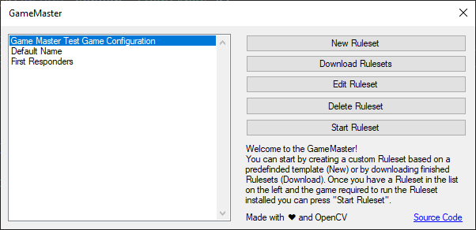
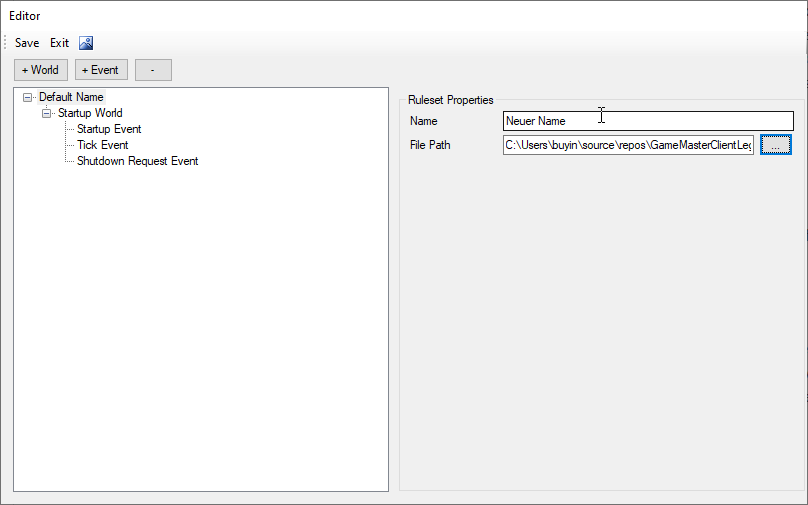
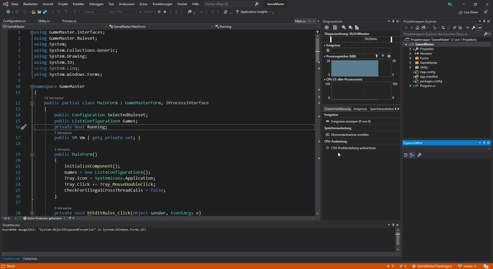
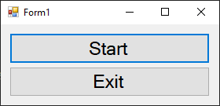

# Der GameMaster

Mit dem 'GameMaster' wollten wir ein Tool entwickeln, das jedem, auch ohne Programmierkentnisse, ermöglicht, eine KI bzw. einen Bot zu entwickeln, die für den Nutzer das Spielen von Computer- und Browsergames übernimmt. Das Ziel war es eine grafische Oberfläche anzubieten, mit der der Nutzer mithilfe von vordefinierten Elementen ein Regelwerk zusammenstellen kann, das der 'GameMaster' dann befolgt. Im folgenden werden wir Schrittweise durch die Anwendung gehen und beispielhaft ein Ruleset für unser Testspiel erstellen. Die Erklärung der technischen Umsetzung folgt weiter unten.

## Ein Ruleset erstellen

### Der Hauptbildschirm



Startet man den 'GameMaster' ist dieser Bildschirm das erste was man sieht. Man bekommt eine Liste mit bereits installierten Rulesets. Wenn man eins ausgewählt hat, kann man es starten - solange man das Spiel, für das das Ruleset konfiguriert wurde, installiert hat - bearbeiten oder löschen. Außerdem kann man jederzeit ein neues Ruleset erstellen, oder versuchen fertiggestellte Rulesets herunterzuladen. In unserem Fall haben wir noch keine Rulesets installiert. Deshalb klicken wir auf `New Ruleset`, um ein neues zu erstellen. So gelangt man in den Ruleset-Editor.

### Editor



Grundsätzlich ist der Ruleset-Editor einfach aufgebaut. Auf der linken Seite gibt es eine hi­e­r­ar­chische Liste. Der Hauptpunkt der Liste repräsentiert das Ruleset selbst. Darunter finden sich "Welten", also bestimmte und unabhängige Zustände des Spiels (z.B. das Hauptmenü, verschiedene Level), und "Events". Events werden entweder intern vom GameMaster oder durch die Konfiguration des Nutzers ausgelöst. In jedem Event lassen sich die "Actions" platzieren, die eigentliche Handlungsanweisungen für den GameMaster. Die Events können sowohl eigenständige Elemente sein, als auch innerhalb einer Welt sein.
Auf der rechten Seite befindet sich ein Panel mit den Eigenschaften des Objektes aus der Liste, welches gerade ausgewählt ist.
Die obere Leiste erlaubt es neue "Objekte" (also Welten, Events und Aktionen) zum Ruleset hinzuzufügen oder zu entfernen, sowie das Ruleset zu speichern und den Editor zu beenden.

### Metadaten

In unserem Fall ist der Eintrag, der das Ruleset selbst repräsentiert ausgewählt. Deshalb sehen wir das Panel für die Ruleset-Metadaten. Hier können wir den Namen ändern und den Pfad zur Exe festlegen. Wir tragen hier als Beispiel "Neuer Name" und den Pfad zu unserem Testspiel ein.

### World-Editor

Standardmäßig enthält jedes Ruleset eine `StartupWorld`. Diese Welt ist von Beginn der Session an aktiv. Sie ist als Art Pseudozustand gedacht, der aktiv ist, während das Spiel noch lädt. Trotzdem hat sie die volle Funktionalität wie andere Welten auch und hat zum Beispiel vordefinierte Events. Das reicht uns allerdings nicht aus. Wir werden zwei neue Welten hinzufügen, eine für das Menü und eine für das eigentliche Spiel. Wir wählen also `+ World` aus und eine neue Welt wird zur Liste hinzugefügt. Nun öffnet sich das Panel zum Bearbeiten von Welten.

TODO: Bild

Hier legen wir ersteinmal den Namen als `Menu World` fest. Anschließend erstellen wir noch eine Welt und nennen diese `Game World`.
Allerdings müssen wir dem GameMaster auch mitteilen, wie die Welten aussehen, bzw. erkannt werden können. Um an die Referenzbilder dafür zu kommen, können wir auch den GameMaster verwenden.

### Ein Ruleset Starten

Dazu klicken wir einfach auf `Save` und `Exit`. Jetzt kann man im Hauptfenster auch unser neues Ruleset sehen und mit `Start` starten.

#### Tastenkombinationen

Während der 'GameMaster' im Spielzustand ist, lassen sich ein paar festgelegte Tastenkombinationen verwenden. Außerdem lassen sich mit den Keyboard-Events im Editor neue Kombinationen erstellen.

|Kombination|Bedeutung|
|-----------|---------|
|Strg + F3|Beendet das Spiel|
|Strg + F4|Erstellt einen Screenshot vom fokussierten Fenster als mögliches Referenzbild|
|Strg + F5|Logging-Stufe ändern|

Alle anderen Tasten werden wie gewohnt als Eingabe an das Spielfenster weitergeleitet. Man kann also auch ins Spielgeschehen eingreifen, um den GameMaster zu "ärgern". :-)

Aber wir wollen ja Referenzbilder erhalten. Also drücken wir im Hauptmenü einmal `Strg + F4` und anschließend klicken wir auf `Start` und drücken nochmal `Strg + F4`. Dann könnnen wir es auch schon wieder mit `Strg + F3` beenden.

#### Image-Editor


#### Event-Editor

TODO: Bild

TODO: Erklärung


#### Action-Editor

TODO: Bild

TODO: Erklärung

Also sollte jetzt sobald die Menüwelt erkannt wird ein "Es funktioniert" ausgegeben werden.

### Overlay

Das wollen wir doch gleich mal testen. Also wieder speichern & zurück zum Hauptfenster. Das Overlay ist normalerweise vollständig transparent, aber wenn man eine `Overlay-Log` Aktion eingebaut oder mit `Strg + F5` die Log-Ausgabestufe erhöht hat, können Nachrichten auf dem Bildschirm erscheinen.
Und wenn das Menü erscheint wird auch schon erfolgreich "Es funktioniert" angezeigt.

TODO: Bild


#### Das fertige Ruleset

TODO: Bild Editor

TODO: Bild Hauptbildschirm

TODO: Update XML

<details>
<summary>Die fertige XML</summary>

```xml
<?xml version="1.0" encoding="utf-8"?>
<configuration xmlns:xsd="http://www.w3.org/2001/XMLSchema" xmlns:xsi="http://www.w3.org/2001/XMLSchema-instance">
  <Name>GameMaster TestGame Library</Name>
  <Executable>C:\Users\buyin\source\repos\GameMasterClientLegacy\TestGame\bin\Debug\TestGame.exe</Executable>
  <Template xsi:type="Platformer" />
  <CustomEvents />
  <LeftSideObjects>
    <LeftSide xsi:type="StartupWorld">
      <Name>StartupWorld</Name>
      <WorldEvents>
        <Event xsi:type="StartupEvent">
          <Name>Startup Event</Name>
          <EventObjects />
        </Event>
        <Event xsi:type="TickEvent">
          <Name>Tick Event</Name>
          <EventObjects />
        </Event>
        <Event xsi:type="ShutdownRequestEvent">
          <Name>Shutdown Request Event</Name>
          <EventObjects />
        </Event>
      </WorldEvents>
    </LeftSide>
    <LeftSide xsi:type="GameWorld">
      <Name>Menu World</Name>
      <WorldEvents>
        <Event xsi:type="StartupEvent">
          <Name>Startup Event</Name>
          <EventObjects />
        </Event>
        <Event xsi:type="TickEvent">
          <Name>Tick Event</Name>
          <EventObjects />
        </Event>
        <Event xsi:type="ShutdownRequestEvent">
          <Name>Shutdown Request Event</Name>
          <EventObjects />
        </Event>
      </WorldEvents>
    </LeftSide>
    <LeftSide xsi:type="GameWorld">
      <Name>Game World</Name>
      <WorldEvents>
        <Event xsi:type="StartupEvent">
          <Name>Startup Event</Name>
          <EventObjects />
        </Event>
        <Event xsi:type="TickEvent">
          <Name>Tick Event</Name>
          <EventObjects />
        </Event>
        <Event xsi:type="ShutdownRequestEvent">
          <Name>Shutdown Request Event</Name>
          <EventObjects />
        </Event>
      </WorldEvents>
    </LeftSide>
  </LeftSideObjects>
</configuration>
```

</details>

### Downloadfenster

TODO: Bild 

Wenn man nicht diesem Prozess folgen möchte, kann man sich das Ruleset auch über das Downloadfenster herunterladen. Dafür muss man nur diesen Link eingeben: TODO: Link


----

# Umsetzung

Hier folgen nun die Erklärungen, wie wir den 'GameMaster' umgesetzt haben.

## Entwicklungsumgebung



Den 'GameMaster' haben wir in C# programmiert. Für die Oberfläche verwenden wir [WindowsForms.](https://github.com/dotnet/winforms). Als IDE verwenden wir [Visual Studio 2019](https://visualstudio.microsoft.com/), da in der Software ein Editor implementiert ist, mit dem man die Benutzeroberfläche mithilfe einiger vorgefertigter Elemente zusammenbauen kann.

TODO: GIF GUI Editing

## 'GameMaster TestGame Library'

Um unser Projekt unter optimalen Bedingungen testen zu können, haben wir zusätzlich noch ein kleines Spiel gebaut, in dem man kleine blaue Vierecke einsammeln muss.
Es besteht lediglich aus zwei Bildschirmen: Dem Menü und dem Spiel.

### Das Menü



Das Menü ist sehr simpel und erfüllt keine weitere Funktion als darüber das Spiel starten zu können. Wir haben dieses Fenster vor dem Hintergrund erstellt, dass wir Text-Erkennung, also den Startknopf, und simulierte Mauseingaben, also das drücken dieses Knopfes, durch den GameMaster testen können.
Die Simplizität des Benutzeroberfläche spiegelt sich auch im Code wieder.

```c#
public partial class MainForm : Form
{
    public MainForm() => InitializeComponent();

```

`InitializeComponent` ist eine Funktion, die von dem Windows-Forms-Designer benötigt wird und wird deshalb hier im Constructor aufgerufen.

```c#
    private void BtStart_Click(object sender, EventArgs e)
    {
        Hide();
        new Collector(this).Show();
    }
```
Es folgen zwei Event-Handler für die `Click`-Events der beiden Knöpfe des Menüs. Da unser Programm beendet wird, wenn wir das Hauptfenster komplett schließen, können wir es nur "verstecken", wenn wir in einen anderen Bildschirm wechseln wollen. Deshalb rufen wir hier die Funktion `Hide` auf. Damit wir später vom Spielbildschirm wieder in den Hauptbildschirm wechseln können, müssen wir dem Spielfenster die Instanz des Menüs mitteilen. Das machen wir über den Constructor des Spielfensters. Mit `this`-wird die aktuelle Instanz der MainForm-Klasse als Parameter des Constructors übertragen. Anschließden lassen wir mit `Show` das gerade erstellte Fenster anzeigen.

```c#
        private void BtExit_Click(object sender, EventArgs e) => Close();
```

Für den Beenden-Knopf wird nur die Funktion `Close` aufgerufen, die dann das Fenster, und somit das ganze Programm, schließt bzw. beendet.

<details>
<summary>Vollständiger Code der MainForm.cs</summary>

```c#
using System;
using System.Windows.Forms;

namespace TestGame
{
    public partial class MainForm : Form
    {
        public MainForm() => InitializeComponent();

        private void BtStart_Click(object sender, EventArgs e)
        {
            Hide();
            new Collector(this).Show();
        }

        private void BtExit_Click(object sender, EventArgs e) => Close();
    }
}
```
</details>

### Das Spiel


```c#
public partial class Collector : Form
{
    private readonly MainForm Main;

    private bool RunningDown = false;
    private bool RunningUp = false;
    private bool RunningLeft = false;
    private bool RunningRight = false;

    private Rectangle obstacle;
    private Rectangle Goal;
    private readonly Random RDM = new Random();

    private int Score = 0;
```

Erstmal definieren wir die wichtigsten Variablen des Spiels: Die Referenz zur MainForm-Instanz, einige Booleans für die Spielerbewegung, zwei Rechtecke, die das Hindernis und das Ziel repräsentieren und die wir später für die Kollisionsabfrage verwenden, sowie ein Random-Stream, den wir für die neue Position des Ziels verwenden werden, sowie eine Variable für die Punktzahl.

```c#
    public Collector(MainForm main)
    {
        InitializeComponent();
        FormBorderStyle = FormBorderStyle.None;
        CenterToScreen();
```

Mit `FormBorderStyle = FormBorderStyle.None;` und `CenterToScreen();` verändern wir die Weise, wie das Fenster angezeigt wird. Das ließe sich auch über das Eigenschaftsfenster in Visual Studio realisieren, aber hier haben wir es über den Code realisiert, weil wir nur diese zwei Zeilen einstellen mussten.

```c#
        KeyDown += KeyPress;
        KeyUp += KeyRelease;
```

Danach weisen wir für das `KeyDown`- und das `KeyUp`-Event Funktionen zu, die als Event-Handler dienen sollen.

```c#
        obstacle = new Rectangle(
            panel2.Location.X,
            panel2.Location.Y,
            panel2.Width,
            panel2.Height

        );
        Goal = new Rectangle(
            panel3.Location.X,
            panel3.Location.Y,
            panel3.Width,
            panel3.Height

        );

        Main = main;
    }
```
In diesem Abschnitt setzen wir die Ursprungswerte für die Rechtecke des Hindernisses und des Zielobjekts und weisen die über die Constructor-Parameter mitgegebene MainForm-Instanz der `Main`-Variable zu. Die visuelle Repräsentation der Objekte auf der Karte lösen wir über Panel-Elemente. Die Positionen und Größen, die wir vorher im Designer festgelegt haben, verwenden wir hier als Startwerte.


```c#
    private bool CheckMovement(Point NextLocation)
    {
        [...]
    }
```

Als nächstes kommt unsere `CheckMovement`-Funktion. Mit ihr überprüfen wir, ob die Koordinaten des Punktes, der als Parameter durchgegeben wird, für den Spieler erreichbar ist. Liegt der Wert außerhalb des Spielfeldes bzw. des Fensterrahmens oder innerhalb des Hindernis-Rechtecks wird `false` ausgegeben. `True` wird also ausgegeben, wenn der Punkt erreichbar ist. Darüberhinaus prüfen wir, ob der Punkt innerhalb des Zielobjektes liegt.

```c#
        if (NextLocation.X >= 586 || NextLocation.X < 0 || NextLocation.Y >= 449 || NextLocation.Y < 0)
            return false;

        if (obstacle.Contains(NextLocation))
            return false;
```

In der ersten Abfrage überprüfen wir, ob der Punkt noch im Spielbereich liegt. Mit der zweiten Abfrage schauen wir mit der `Contains`-Funktion, ob die das Rechteck des Hindernisses den Punkt enthält.

```c#
        if (Goal.Contains(NextLocation))
        {
            Point NewLocation = new Point(RDM.Next(0, this.Size.Width), RDM.Next(0, this.Size.Height));
```

Mit der nächsten Abfrage überprüfen wir, ob der Punkt innerhalb des Zielobjektes liegt. Wenn dem so sein sollte, erstellen wir einen neuen Punkt mithilfe des Random-Streams `RDM`, den wir vorher erstellt hatten. Für die `x`- und `y`-Werte legen wir jeweils die Breite bzw. die Höhe des Spielfensters als Maximalwert fest.

```c#
            while (obstacle.Contains(NewLocation.X, NewLocation.Y))
            {
                NewLocation = new Point(RDM.Next(0, this.Size.Width), RDM.Next(0, this.Size.Height));
            }
```

Mit dieser `while`-Schleife sagen wir, dass, solange der neue Punkt innerhalb des Hindernisses liegt, die Generierung des Punktes wiederholt werden muss. Schließlich wäre das Ziel nicht erreichbar, wenn es innerhalb dieses Rechteckes liegen würde.

```c#
            panel3.Location = NewLocation;
            Goal = new Rectangle(
                panel3.Location.X,
                panel3.Location.Y,
                panel3.Width,
                panel3.Height
            );
            Score++;
        }
        return true;
```

Liegt der Punkt an einer gültigen Position, können wir das Panel des Ziels an die neue Position verschieben und das Rechteck, das das Ziel im Code repräsentiert aktualisieren, die Punktzahl erhöhen und schließlich `true` ausgeben, damit der Spieler sich auch bewegen kann.

```c#
        private new void KeyPress(object sender, KeyEventArgs e)
        {
            if (e.KeyCode == Keys.W)
                RunningUp = true;
            if (e.KeyCode == Keys.S)
                RunningDown = true;
            if (e.KeyCode == Keys.A)
                RunningLeft = true;
            if (e.KeyCode == Keys.D)
                RunningRight = true;

            if (e.KeyCode == Keys.OemMinus)
                Environment.Exit(1);

            if (e.KeyCode == Keys.Oemplus)
            {
                Close();
                Main.Show();
            }
        }

```

Mit diesem Event-Handler verarbeiten wir das `KeyDown`-Event des Fensters. Mit W/A/S/D (oben, links, unten, rechts) soll der Spieler bewegt werden. Deshalb setzen wir den sobald eine dieser Tasten gedrückt wird, den dazugehörigen "Running"-Boolean. Außerdem erlauben wir noch mit "-" das Spiel bzw. das ganze Programm zu beenden und mit "+" wieder ins Menü zu gelangen.

Und damit die Spielfigur sich nicht unendlich lang bewegt, müssen wir natürlich noch den Handler für das `KeyUp`-Event so programmieren, dass die "Running"-Boleans wieder auf `false` gesetzt werden.

```c#
        private void KeyRelease(object sender, KeyEventArgs e)
        {
            if (e.KeyCode == Keys.W)
                RunningUp = false;
            if (e.KeyCode == Keys.S)
                RunningDown = false;
            if (e.KeyCode == Keys.A)
                RunningLeft = false;
            if (e.KeyCode == Keys.D)
                RunningRight = false;
        }
```

Danach folgen die eigentlichen Bewegungsfunktionen. Wir nehmen hier mal `GoUp` als Beispiel.

```c#
        private void GoUp()
        {
            Point NextLocation = new Point(panel1.Location.X, panel1.Location.Y - 3);
            if (CheckMovement(NextLocation))
                panel1.Location = NextLocation;
        }
```

In dieser Funktion wird der Punkt berechnet, zu dem sich der Spieler bewegen würden. In diesem Fall muss die `x`-Koordinate gleich bleiben, während der `y`-Wert verringert wird, da der Koordinatenursprung in der linken, oberen Ecke des Fensters ist. Dann rufen wir mit einer if-Abfrage unsere `CheckMovement`-Funktion auf, und wenn der Ort gültig ist, setzten wir die Position des Spieler-Panels. Die restlichen Bewegungsfunktionen unterscheiden sich nur durch das Vorzeichen bzw. die Achse.

Und abschließend kommt die `Tick`-Funktion des Timers, den wir auch als Windows-Forms-Element zum Fenster hinzugefügt haben. Wir haben den Interval des Timers auf 10ms gestellt, diese Funktion wird also 100 mal in der Sekunde aufgerufen.

```c#
        private void Timer1_Tick(object sender, EventArgs e)
        {
            label1.Text = $"Score: {Score.ToString()}";

            if (RunningUp == true)
                GoUp();
            if (RunningDown == true)
                GoDown();
            if (RunningLeft == true)
                GoLeft();
            if (RunningRight == true)
                GoRight();
        }
```

In dieser Funktion aktualisieren wir die Punkteanzeige und rufen, wenn einer der Bewegungs-Booleans gesetzt ist, die jeweilige Bewegungsfunktion auf.

<details>

<summary>Vollständiger Code der Collector.cs</summary>

```c#
using System;
using System.Drawing;
using System.Windows.Forms;

namespace TestGame
{
    public partial class Collector : Form
    {
        private readonly MainForm Main;

        private bool RunningDown = false;
        private bool RunningUp = false;
        private bool RunningLeft = false;
        private bool RunningRight = false;

        private Rectangle obstacle;
        private Rectangle Goal;
        private readonly Random RDM = new Random();

        private int Score = 0;

        public Collector(MainForm main)
        {
            InitializeComponent();
            FormBorderStyle = FormBorderStyle.None;
            CenterToScreen();
            KeyDown += KeyPress;
            KeyUp += KeyRelease;
            obstacle = new Rectangle(
                panel2.Location.X,
                panel2.Location.Y,
                panel2.Width,
                panel2.Height

            );
            Goal = new Rectangle(
               panel3.Location.X,
               panel3.Location.Y,
               panel3.Width,
               panel3.Height

            );

            Main = main;
        }

        private bool CheckMovement(Point NextLocation)
        {
            if (NextLocation.X >= 586 || NextLocation.X < 0 || NextLocation.Y >= 449 || NextLocation.Y < 0)
                return false;

            if (obstacle.Contains(NextLocation))
                return false;

            if (Goal.Contains(NextLocation))
            {
                Point NewLocation = new Point(RDM.Next(0, this.Size.Width), RDM.Next(0, this.Size.Height));
                while (obstacle.Contains(NewLocation.X, NewLocation.Y))
                {
                    NewLocation = new Point(RDM.Next(0, this.Size.Width), RDM.Next(0, this.Size.Height));
                }
                panel3.Location = NewLocation;
                Goal = new Rectangle(
                   panel3.Location.X,
                   panel3.Location.Y,
                   panel3.Width,
                   panel3.Height
                );
                Score++;
            }
            return true;
        }

        private new void KeyPress(object sender, KeyEventArgs e)
        {
            if (e.KeyCode == Keys.W)
                RunningUp = true;
            if (e.KeyCode == Keys.S)
                RunningDown = true;
            if (e.KeyCode == Keys.A)
                RunningLeft = true;
            if (e.KeyCode == Keys.D)
                RunningRight = true;

            if (e.KeyCode == Keys.OemMinus)
                Environment.Exit(1);

            if (e.KeyCode == Keys.Oemplus)
            {
                Close();
                Main.Show();
            }
        }

        private void KeyRelease(object sender, KeyEventArgs e)
        {
            if (e.KeyCode == Keys.W)
                RunningUp = false;
            if (e.KeyCode == Keys.S)
                RunningDown = false;
            if (e.KeyCode == Keys.A)
                RunningLeft = false;
            if (e.KeyCode == Keys.D)
                RunningRight = false;
        }

        private void GoUp()
        {
            Point NextLocation = new Point(panel1.Location.X, panel1.Location.Y - 3);
            if (CheckMovement(NextLocation))
                panel1.Location = NextLocation;
        }

        private void GoDown()
        {
            Point NextLocation = new Point(panel1.Location.X, panel1.Location.Y + 3);
            if (CheckMovement(new Point(NextLocation.X, NextLocation.Y + panel1.Height)))
                panel1.Location = NextLocation;
        }

        private void GoLeft()
        {
            Point NextLocation = new Point(panel1.Location.X - 3, panel1.Location.Y);
            if (CheckMovement(NextLocation))
                panel1.Location = NextLocation;
        }

        private void GoRight()
        {
            Point NextLocation = new Point(panel1.Location.X + 3, panel1.Location.Y);
            if (CheckMovement(new Point(NextLocation.X + panel1.Width, NextLocation.Y)))
                panel1.Location = NextLocation;
        }

        private void Timer1_Tick(object sender, EventArgs e)
        {
            label1.Text = $"Score: {Score.ToString()}";

            if (RunningUp == true)
                GoUp();
            if (RunningDown == true)
                GoDown();
            if (RunningLeft == true)
                GoLeft();
            if (RunningRight == true)
                GoRight();
        }
    }
}
```
</details>

## GameMaster

### MainFormHelper

Wie bei unserem Testspiel gilt: Wir können das Hauptfenster nicht schließen, sondern lediglich verstecken und irgendwo speichern. Außerdem müssen wir auch manchmal auf die MainForm-Instanz zugreifen, um einige Variablen zu setzen. Deshalb haben wir die statische `MainFormHelper`-Klasse erstellt. Diese enthält eine statische `MainForm`-Variable, die die Singleton-Instanz unserer MainForm darstellt. Zusätzlich verfügt sie über zwei Funktionen: `Show`, die wir aufrufen, wenn wir das Fenster anzeigen wollen, und `Get`, die wir verwenden, wenn wir eine Referenz zur MainForm brauchen, um z.B. Variable zu ändern.

```c#
public static class MainFormHelper
{
    private static MainForm _main;

    public static void Show()
    {
        if (_main == null) { _main = new MainForm(); }
        _main.Show();
    }

    public static MainForm Get()
    {
        if (_main == null) { _main = new MainForm(); }
        return _main;
    }
}
```
*Aus Main.cs*

In beiden Fällen wird zuerst überprüft, ob die MainForm `_main` bereits existiert, oder ob diese noch initialisiert werden muss. Anschließend wird die MainForm entweder direkt angezeigt oder zurückgegeben. 


Diese Klasse wird auch direkt beim Programmstart verwendet:

```c#
internal static class Program
{
    /// <summary>
    /// The main entry point for the application.
    /// </summary>
    [STAThread]
    private static void Main()
    {
        [...]
        Application.Run(MainFormHelper.Get());
    }
}
```
*Aus Program.cs*

<details>
<summary>Vollständiger Code der Program.cs</summary>

```c#
using System;
using System.Windows.Forms;

namespace GameMaster
{
    internal static class Program
    {
        /// <summary>
        /// The main entry point for the application.
        /// </summary>
        [STAThread]
        private static void Main()
        {
            Application.EnableVisualStyles();
            Application.SetCompatibleTextRenderingDefault(false);
            Application.Run(MainFormHelper.Get());
        }
    }
}
```

</details>

### MainForm


<details>
<summary>Vollständiger Code der Main.cs</summary>

```c#
using GameMaster.Interfaces;
using GameMaster.Ruleset;
using System;
using System.Collections.Generic;
using System.Drawing;
using System.Windows.Forms;

namespace GameMaster
{
    public partial class MainForm : Form, IProcessInterface
    {
        public Configuration SelectedRuleset;
        public List<Configuration> Games;
        private bool Running;
        public VM Vm { get; private set; }

        public MainForm()
        {
            InitializeComponent();
            Games = new List<Configuration>();
            Tray.Icon = SystemIcons.Application;
            Tray.Click += Tray_MouseDoubleClick;
            CheckForIllegalCrossThreadCalls = false;
        }

        private void listBox1_SelectedIndexChanged(object sender, EventArgs e)
        {
            // Checks if there are items in the box
            if (listBox1.Items.Count == 0)
            {
                btStart.Enabled = false;
                btEditProp.Enabled = false;
                btDelete.Enabled = false;
                return;
            }

            btEditProp.Enabled = true;
            btDelete.Enabled = true;

            if (listBox1.SelectedItem != null)
            {
                SelectedRuleset = Games[listBox1.SelectedIndex];
                if (SelectedRuleset.ValidAction() && !Running)
                {
                    btStart.Enabled = true;
                }
                else
                {
                    btStart.Enabled = false;
                }
            }
        }

        private void btNew_Click(object sender, EventArgs e)
        {
            SelectedRuleset = new Configuration();
            new EditForm().Show();
            Hide();
        }

        private void btEditProp_Click(object sender, EventArgs e)
        {
            EditorForm editor = new EditorForm();
            editor.Text = "Edit " + SelectedRuleset.Name;
            editor.Show();
            Hide();
        }

        private void btAdd_Click(object sender, EventArgs e)
        {
            new DownloadForm().Show();
            Hide();
        }

        public void UpdateList()
        {
            listBox1.Items.Clear();
            foreach (Configuration config in Games)
            {
                listBox1.Items.Add(config.Name);
            }
        }

        private void lErscheinungsdatum_Load(object sender, EventArgs e)
        {
            Configuration.DiscoverRulesets();
            UpdateList();
            if (listBox1.Items.Count > 0)
                listBox1.SelectedIndex = 0;
        }

        private void btStart_Click(object sender, EventArgs e) => Vm = new VM(SelectedRuleset);

        private void Tray_MouseDoubleClick(object sender, EventArgs e)
        {
            Vm.Interrupt();
            MainFormHelper.Show();
            Tray.Visible = false;
            WindowState = FormWindowState.Normal;
        }

        private void SourceCodeLink_LinkClicked(object sender, LinkLabelLinkClickedEventArgs e) => System.Diagnostics.Process.Start(GameMaster.Properties.Resources.Repository);

        private void button1_Click(object sender, EventArgs e)
        {
            var confirmResult = MessageBox.Show("Are you sure to delete this ruleset? This cannot be undone!", "Confirmation needed", MessageBoxButtons.YesNo);
            if (confirmResult == DialogResult.Yes)
            {
                listBox1.Items.RemoveAt(listBox1.SelectedIndex);
                SelectedRuleset.Delete();
                SelectedRuleset = null;
            }
        }

        /// <summary>
        /// Called when the game process is started
        /// </summary>
        public void ProcessStarted()
        {
            Running = true;
            Tray.Visible = true;
            Hide();
        }

        /// <summary>
        /// Called when the game process has been terminated
        /// </summary>
        public void ProcessEnded()
        {
            Running = false;
            MainFormHelper.Show();
            WindowState = FormWindowState.Normal;
            Tray.Visible = false;
            Vm = null;
        }
    }

    public static class MainFormHelper
    {
        private static MainForm _main;

        public static void Show()
        {
            if (_main == null) { _main = new MainForm(); }
            _main.Show();
        }

        public static MainForm Get()
        {
            if (_main == null) { _main = new MainForm(); }
            return _main;
        }
    }
}
```
</details>

### DownloadForm

```c#
        private void tbQuelle_TextChanged(object sender, EventArgs e)
        {
            if (!ValidateUrl(tbQuelle.Text))
            {
                btStart.Enabled = false;
                return;
            }
            btStart.Enabled = true;
        }
```
Zuerst haben wir einen Event-Handler für das `TextChanged`-Event der Textbox. Sobald der Benutzer anfängt eine URL einzugeben, überprüfen wir mit unserer `ValidateUrl`-Funktion so gut es geht, ob es sich bei dem eingegeben Text um eine gültige URL handelt. Wenn die URL als ungültig erkannt werden sollte, wird der Start-Knopf ausgegraut. Doch wie sieht diese Prüfung aus?

```c#
        private bool ValidateUrl(string Url)
        {
            // Is using http / https
            if (!Url.StartsWith("http://") && !Url.StartsWith("https://"))
            {
                return false;
            }

            // Target is a .zip archive
            if (!Url.EndsWith(".zip"))
            {
                return false;
            }

            string[] substrings = Url.Split('/');

            /// Target archive has a name
            /// (Checks if there are characters between the last '/' and the .zip)
            if (substrings.Last() == ".zip")
            {
                return false;
            }
            return true;
        }
```

Zunächst schauen wir, ob der String mit einem `http://` oder `https://` beginnt. Danach überprüfen wir, ob die URL auf `.zip` endet, da wir mit der DownloadForm eben nur zip-Archive runterladen und entpacken können. Sollten beide Fälle zutreffen, überprüfen wir noch, ob die `.zip` auch einen Namen hat, oder ob einfach `/.zip` eingegeben wurde. Sind alle Anforderungen erfüllt, kann der Download losgehen.

```c#
        private void btStart_Click(object sender, EventArgs e)
        {
            if(Directory.Exists(TempDirectory))
                Directory.Delete(TempDirectory, true);

            if (!Directory.Exists(DownloadDirectory))
                Directory.CreateDirectory(DownloadDirectory);

            using (WebClient wc = new WebClient())
            {
                wc.DownloadProgressChanged += WC_DownloadProgressChanged;
                wc.DownloadFileCompleted += WC_DownloadFileCompleted;
                rtbStatus.AppendText("Downloading now...\n");
                wc.DownloadFileAsync(
                    new System.Uri(tbQuelle.Text;),
                    Path.Combine(DownloadDirectory, "Download.zip")
                );
            }
        }
```

Im Event-Handler für den Startknopf sorgen wir zuerst dafür, dass das `TempDirectory` gelöscht wird. In diesen Ordner werden wir später das Zip-Archiv extrahieren. Wären dort noch Dateien vorhanden, könnten diese später zu Problemen führen. Danach wird der Download-Ordner erstellt, in das das Archiv gelegt wird, während der Download noch läuft.

Sind diese Schritte erledigt, können wir uns dem Download widmen. Dieser wird über einen `[WebClient](https://docs.microsoft.com/en-us/dotnet/api/system.net.webclient?view=netframework-4.8)` realisiert. Dafür legen wir zuerst für das `DownloadProgressChanged` und das `DownloadFileCompleted`-Event des WebClients unsere Event-Handler fest. Danach wird mit `rtbStatus.AppendText(Downloading now...)` der Nutzer darüber informiert, dass der Download jetzt started. Abschließend stellen wir als Download-URL den Inhalt der Textbox ein und legen fest, dass die Datei als `Download.zip` im Downloadordner gespseichert werden soll.

```c#
        private void WC_DownloadProgressChanged(object sender, DownloadProgressChangedEventArgs e) => pbProgress.Value = e.ProgressPercentage;

        private void WC_DownloadFileCompleted(object sender, EventArgs e)
        {
            rtbStatus.AppendText("Finished!\n");
            ZipHandling();
        }
```

Das sind unsere eben erwähnten Event-Handler. Wenn sich der Downloadfortschritt ändert, wird lediglich die Fortschrittsanzeige aktualisiert. Wenn der Download abgeschlossen ist, wird einerseits der Nutzer darüber informiert, andererseits starten wir die `ZipHandling`-Funktion mit der wir das Archiv entpacken.

```c#
        private void ZipHandling()
        {
            rtbStatus.AppendText("Extracting archive...\n");
            ZipFile.ExtractToDirectory(Path.Combine(DownloadDirectory, "Download.zip"), TempDirectory);
            
            rtbStatus.AppendText("Done! Checking files...\n");
            string[] dirs = Directory.GetDirectories(TempDirectory);
            int SetCount = 0;
            foreach (string dir in dirs)
            {
                foreach (string File in Directory.GetFiles(dir))
                {
                    if (File.Contains("config.xml"))
                    {
                        if (FileHandling(dir))
                            SetCount++;
                    }
                }
            }
            rtbStatus.AppendText("Found " + SetCount.ToString() + " valid rulesets!\n");
        }
```

Zu Beginn wird der Nutzer informiert, dass das Archiv nun extrahiert wird. Das Extrahieren setzten wir mit der `[ZipFile](https://docs.microsoft.com/en-us/dotnet/api/system.io.compression.zipfile?view=netframework-4.8)`-Klasse um. Ist das Extrahieren abgeschlossen, könnten wir zwar theoretisch die neuen Dateien einfach verschieben, aber wir wollen zuerst verifizieren, dass es sich um gültige Rulesets handelt. Dafür haben wir einen einfach Loop über alle Ordner im temporären Verzeichnis. Zusätzlich haben wir einen Loop über alle Dateien, die sich im Ordner der aktuellen Iteration des Ordner-Loops befinden. Da überprüfen wir, ob es sich bei der Datei um eine `config.xml` handelt. Diesen Namen setzen wir für Rulesets voraus. Handelt es sich um eine `config.xml` wird sie mit unserer `FileHandling`-Funktion verifiziert. Ist sie gültig, `FileHandling` gibt also `true` aus, wird der Set-Counter um eins erhöht, damit wir dem Nutzer die Anzahl der gefundenen, gültigen Rulesets ausgeben können.

```c#
        private bool FileHandling(string folder)
        {
            Configuration ruleset = Configuration.TryLoadConfig(folder);
            if (ruleset == null)
                return false;

            string[] pathElements = folder.Split('\\');

            Directory.Move(Path.Combine(TempDirectory, pathElements[pathElements.Length - 1]), Path.Combine(RulesetDirectory, pathElements[pathElements.Length - 1]));
            MainFormHelper.Get().Games.Add(ruleset);
            MainFormHelper.Get().UpdateList();

            return true;
        }
```

In der `FileHandling`-Funktion wird versucht den Inhalt der XML in eine `Configuration`-Instanz zu deserialisieren. Sollte das Fehlschlagen, also `null` zurückkommen, passiert nichts weiter. Ist die XML gültig, wird sie in den Ruleset-Ordner verschoben, damit sie auch beim nächsten Start noch gefunden wird, und die Liste der `MainForm` wird aktualisiert.

<details>
<summary>Vollständiger Code der DownloadForm.cs</summary>

```c#
using System;
using System.IO;
using System.IO.Compression;
using System.Linq;
using System.Net;
using System.Windows.Forms;
using GameMaster.Ruleset;

namespace GameMaster
{
    public partial class DownloadForm : Form
    {
        string DownloadDirectory = Utility.DownloadDirectory;
        string RulesetDirectory = Utility.RulesetDirectory;
        string TempDirectory = Utility.TempDirectory;

        public DownloadForm() => InitializeComponent();

        private void btExit_Click(object sender, EventArgs e)
        {
            MainFormHelper.Show();
            Close();
        }

        private void tbQuelle_TextChanged(object sender, EventArgs e)
        {
            if (!ValidateUrl(tbQuelle.Text))
            {
                btStart.Enabled = false;
                return;
            }
            btStart.Enabled = true;
        }

        /// <summary>
        /// Checks if the given string is a valid URL.
        /// Also ensures it's a .zip
        /// </summary>
        /// <param name="Url">The string to be checked</param>
        /// <returns>Whether it's valid or not</returns>
        private bool ValidateUrl(string Url)
        {
            // Is using http / https
            if (!Url.StartsWith("http://") && !Url.StartsWith("https://"))
            {
                return false;
            }

            // Target is a .zip archive
            if (!Url.EndsWith(".zip"))
            {
                return false;
            }

            string[] substrings = Url.Split('/');

            /// Target archive has a name
            /// (Checks if there are characters between the last '/' and the .zip)
            if (substrings.Last() == ".zip")
            {
                return false;
            }
            return true;
        }

        private void btStart_Click(object sender, EventArgs e)
        {
            if(Directory.Exists(TempDirectory))
                Directory.Delete(TempDirectory, true);

            if (!Directory.Exists(DownloadDirectory))
                Directory.CreateDirectory(DownloadDirectory);

            using (WebClient wc = new WebClient())
            {
                rtbStatus.AppendText("Downloading now...\n");
                wc.DownloadProgressChanged += WC_DownloadProgressChanged;
                wc.DownloadFileCompleted += WC_DownloadFileCompleted;
                wc.DownloadFileAsync(
                    new System.Uri(tbQuelle.Text),
                    Path.Combine(DownloadDirectory, "Download.zip")
                );
            }
        }

        private void WC_DownloadProgressChanged(object sender, DownloadProgressChangedEventArgs e) => pbProgress.Value = e.ProgressPercentage;

        private void WC_DownloadFileCompleted(object sender, EventArgs e)
        {
            rtbStatus.AppendText("Finished!\n");
            ZipHandling();
        }

        /// <summary>
        /// Unzips the archive
        /// </summary>
        private void ZipHandling()
        {
            rtbStatus.AppendText("Extracting archive...\n");
            ZipFile.ExtractToDirectory(Path.Combine(DownloadDirectory, "Download.zip"), TempDirectory);
            
            rtbStatus.AppendText("Done! Checking files...\n");
            string[] dirs = Directory.GetDirectories(TempDirectory);
            int SetCount = 0;
            foreach (string dir in dirs)
            {
                foreach (string File in Directory.GetFiles(dir))
                {
                    if (File.Contains("config.xml"))
                    {
                        if (FileHandling(dir))
                            SetCount++;
                    }
                }
            }
            rtbStatus.AppendText("Found " + SetCount.ToString() + " valid rulesets!\n");
        }

        /// <summary>
        /// Moves the rulesets to the proper folder
        /// </summary>
        /// <param name="Name">The folder name</param>
        private bool FileHandling(string folder)
        {
            Configuration ruleset = Configuration.TryLoadConfig(folder);
            if (ruleset == null)
                return false;

            string[] pathElements = folder.Split('\\');

            Directory.Move(Path.Combine(TempDirectory, pathElements[pathElements.Length - 1]), Path.Combine(RulesetDirectory, pathElements[pathElements.Length - 1]));
            MainFormHelper.Get().Games.Add(ruleset);
            MainFormHelper.Get().UpdateList();

            return true;
        }
    }
}
```
</details>

### Rulesets

Bevor wir uns den eigentlichen Editor genauer anschauen, werden wir einen Blick auf die eigentlichen Rulesets werfen und wie diese aufgebaut sind und gespeichert werden.

<details>
<summary>Vollständiger Code der Configuration.cs</summary>

```c#
[XmlRoot("configuration")]
[XmlInclude(typeof(Templates.Template2D))]
[XmlInclude(typeof(Templates.Platformer))]
[XmlInclude(typeof(Events.CustomEvent))]
[XmlInclude(typeof(Events.StartupEvent))]
[XmlInclude(typeof(Events.ShutdownRequestEvent))]
[XmlInclude(typeof(Events.KeyPressEvent))]
[XmlInclude(typeof(Events.TickEvent))]
[XmlInclude(typeof(Actions.Avoid))]
[XmlInclude(typeof(Actions.Click))]
[XmlInclude(typeof(Actions.ExecuteCustomEvent))]
[XmlInclude(typeof(Actions.Log))]
[XmlInclude(typeof(Actions.Move))]
[XmlInclude(typeof(Actions.OverlayLog))]
[XmlInclude(typeof(Worlds.GameWorld))]
[XmlInclude(typeof(Worlds.StartupWorld))]
public class Configuration
{
    public Configuration()
    {
        Name = "Default Name";
        ID = "defaultid";
        Executable = "";
        Template = new Platformer();
        CustomEvents = new List<Event>();
        LeftSideObjects = new List<LeftSide>();
    }

    public String Name;
    public String ID;
    public String Executable;
    public Template Template;
    public List<Event> CustomEvents;
    public List<LeftSide> LeftSideObjects;

    [XmlIgnore]
    public string Folder;

    /// <summary>
    /// Saves the specified ruleset as an XML to the specified path
    /// </summary>
    /// <param name="ruleset">The ruleset to be saved</param>
    public static void Save(Configuration ruleset)
    {
        XmlSerializer serializer = new XmlSerializer(typeof(Configuration));
        TextWriter writer = new StreamWriter(Path.Combine(Utility.RulesetDirectory + ruleset.Folder) + "\\config.xml");
        serializer.Serialize(writer, ruleset);
        writer.Flush();
        writer.Close();
    }

    /// <summary>
    /// Deletes a ruleset
    /// </summary>
    public void Delete()
    {
        MainForm Main = MainFormHelper.Get();
        Main.Games.Remove(this);
        Main.UpdateList();
        Directory.Delete(Path.Combine(Utility.RulesetDirectory, Folder), true);
    }

    /// <summary>
    /// Checks if the executable specified in the StartAction property is valid
    /// </summary>
    /// <returns>Whether the start action is valid or not</returns>
    public bool ValidAction()
    {
        if (File.Exists(Executable) && Executable.EndsWith(".exe"))
            return true;
        return false;
    }

    /// <summary>
    /// Loops over every folder inside the ruleset directory and looks for valid config.xml files. Valid configurations are added to the list of the  main form.
    /// </summary>
    public static void DiscoverRulesets()
    {
        if (!Directory.Exists(Utility.RulesetDirectory))
        {
            Directory.CreateDirectory(Utility.RulesetDirectory);
            return;
        }

        foreach (string directory in Directory.GetDirectories(Utility.RulesetDirectory))
        {
            string file = directory + "\\config.xml";
            if (!File.Exists(file))
                continue;

            XmlSerializer deserializer = new XmlSerializer(typeof(Configuration));
            TextReader reader = new StreamReader(file);
            try
            {
                object obj = deserializer.Deserialize(reader);
                Configuration ruleset = (Configuration)obj;
                reader.Close();
                string[] pathElements = directory.Split('\\');
                ruleset.Folder = pathElements[pathElements.Length - 1];
                MainFormHelper.Get().Games.Add(ruleset);
            }
            catch
            {
                reader.Close();
                continue;
            }
        }
    }
}
```

</details>

### Editor

#### Metadata-Editor

#### Cropping-Tool

TODO: Image

Das Cropping-Tool kann dazu verwendet werden, um den wichtigen Bereich eines Referenzbildes aus dem ünnötigen Rest herauszuschneiden und gesondert, als eigentliche Referenz zu speichern.

<details>
<summary>Vollständiger Code der ImageEditor.cs</summary>

```c#
public partial class ImageEditor : Form
{
    private World.ImageRecognition item;
    private Image loadedImage;
    private Bitmap @new;
    private int x;
    private int y;
    private int width;
    private int height;
    private Pen CropPen = new Pen(Color.Red);
    private bool cropping = false;

    public ImageEditor(World.ImageRecognition item = null)
    {
        InitializeComponent();
        this.item = item;
    }

    ~ImageEditor()
    {
        CropPen.Dispose();
        loadedImage.Dispose();
        @new.Dispose();
    }

    private void button3_Click(object sender, EventArgs e)
    {
        openFileDialog1.ShowDialog();
        openFileDialog1.FileOk += fileSelected;
    }

    private void fileSelected(object sender, CancelEventArgs e)
    {
        FileStream fs = new FileInfo(openFileDialog1.FileName).OpenRead();
        loadedImage = Image.FromStream(fs);
        pictureBox1.Image = Utility.ResizeImage(loadedImage, pictureBox1.Width, pictureBox1.Height);
        fs.Close();
    }

    private void ImageEditor_Load(object sender, EventArgs e)
    {
        openFileDialog1.InitialDirectory = AppContext.BaseDirectory;
        cropWindow = pictureBox1.CreateGraphics();
    }

    private void button1_Click(object sender, EventArgs e)
    {
        //item.UpdateReference(@new);
        pictureBox2.Image = pictureBox2.Image;
        pictureBox3.Image = null;
    }

    private void button2_Click(object sender, EventArgs e) => Close();

    private void pictureBox1_MouseDown(object sender, MouseEventArgs e)
    {
        x = e.X;
        y = e.Y;
        cropping = true;
    }

    private Rectangle Selection;

    private void pictureBox1_MouseUp(object sender, MouseEventArgs e)
    {
        if (loadedImage == null)
            return;

        width = e.X - x;
        height = e.Y - y;
        if (width > 0 && height > 0)
        {
            Selection = new Rectangle(x, y, width, height);
            Bitmap test = Utility.ResizeImage(new Bitmap(loadedImage), pictureBox1.Width, pictureBox1.Height);
            @new = test.Clone(Selection, loadedImage.PixelFormat);
            pictureBox3.Image = @new;
        }
        Reset();
    }

    private void Reset()
    {
        cropping = false;
        x = 0;
        y = 0;
        width = 0;
        height = 0;
    }

    private Graphics cropWindow;

    private void pictureBox1_MouseMove(object sender, MouseEventArgs e)
    {
        if (cropping && loadedImage != null)
        {
            cropWindow = pictureBox1.CreateGraphics();
            cropWindow.DrawImage(Utility.ResizeImage(loadedImage, pictureBox1.Width, pictureBox1.Height), new Point(0, 0));
            width = e.X - x;
            height = e.Y - y;
            cropWindow.DrawRectangle(CropPen, x, y, width, height);
        }
    }
}
```

</details>

### Der GameMaster / Process.cs

<details>
<summary>Vollständiger Code der Process.cs</summary>

```c#

```
</details>

### Das Overlay

Für das Overlay verwenden wir die Bibliothek [GameOverlay.Net](https://github.com/michel-pi/GameOverlay.Net) (MIT). Da wir das Overlay lediglich dafür verwenden einige Log-Nachrichten auf dem Bildschirm anzeigen zu lassen, reicht und hauptsächlich eine gekürzte Version des [Beispielcodes](https://github.com/michel-pi/GameOverlay.Net/blob/master/source/Examples/Example.cs) der Bibliothek. Wir werden hier hauptsächlich unseren Logging-Mechanismus erklären.

#### Logging.cs

```c#
    public class LogMessage
    {
        public string message;
        public int clockCount;

        public LogMessage(string logMessage)
        {
            message = logMessage;
            clockCount = 0;
        }
    }
```
*Aus [Logging.cs](../GameMaster/GameMaster/Logging.cs)*

Unsere `LogMessage`-Klasse enthält einen String für die eigentliche Nachricht und einen Zähler `clockCount`. Dieser steht standardmäßig auf `0`. Diesen Timer verwenden wir, wenn es darum geht Nachrichten wieder auszublenden.

#### Overlay.cs

```c#
    internal List<LogMessage> logMessages = new List<LogMessage>();
```

Zuerst erstellen wir eine Liste mit `LogMessage`-Nachrichten. In dieser werden alle Nachrichten, die angezeigt werden gespeichert.

```c#
    public void Run()
    {
        var gfx = _graphics;
        gfx.BeginScene();
        gfx.ClearScene();
        for (int i = 0; i < logMessages.Count - 1; i++)
        {
            gfx.DrawTextWithBackground(_font, 16f, _red, _black, new Point(0, i * 25), logMessages[i].message);
        }
        [...]
    }
```

Die `Run`-Funktion ist die Funktion, die dafür sorgt das Overlay zu aktualisieren. Mit `BeginScene` wird ein neuer Frame erstellt. Mit `ClearScene` wird dieser Frame transparent gemacht. Anschließend iterieren wir für jede `LogMessage` aus unserer vorher erstellten Liste. Mit `DrawTextWithBackground` wird die eigentliche Anzeige erstellt. Mit `new Point(0, i * 25)` setzten wir die Bildschirmkoordinaten der Nachricht in Abhängigkeit des Indexes der Nachricht. Da eine Nachricht 25 Pixel groß ist, verwenden wir diesen Faktor 25.

```c#
        public void Log(string Message) => logMessages.Add(new LogMessage(Message));
```

Mit dieser Funktion wird eine neue Instanz der `LogMessage`-Klasse zur Nachrichtenliste hinzugefügt, wenn man `Overlay.Log("...")` aufruft.

```c#
        public void UpdateLog()
        {
            for (int i = 0; i < logMessages.Count - 1; i++)
            {
                LogMessage message = logMessages[i];
                message.clockCount++;
                if (message.clockCount == 4)
                {
                    logMessages.Remove(message);
                }
            }
        }
```

Die `UpdateLog`-Funktion ist nun die eigentliche Logik des Overlay-Logs. Hier wird jedes mal, wenn diese Funktion aufgerufen wird, der `clockCount` aller Nachrichten um `+1` erhöht. Hat eine Nachricht einen `clockCount` von 4 erreicht, wird die Nachricht aus der Liste gelöscht und vom Bildschirm entfernt.

<details>
<summary>Vollständiger Code der Overlay.cs</summary>

```c#
using GameMaster.Logging;
using GameOverlay.Drawing;
using GameOverlay.Windows;
using System;
using System.Collections.Generic;
using System.Windows.Forms;

namespace GameMaster.Overlay
{
    public class GameMasterOverlay
    {
        private readonly OverlayWindow _window;
        private readonly Graphics _graphics;
        private Font _font;
        private SolidBrush _black;
        private SolidBrush _red;
        internal List<LogMessage> logMessages = new List<LogMessage>();

        public GameMasterOverlay()
        {
            _window = new OverlayWindow(0, 0, Screen.PrimaryScreen.Bounds.Width, Screen.PrimaryScreen.Bounds.Height)
            {
                IsTopmost = true,
                IsVisible = true
            };

            _window.SizeChanged += _window_SizeChanged;

            _graphics = new Graphics
            {
                Height = _window.Height,
                PerPrimitiveAntiAliasing = true,
                TextAntiAliasing = true,
                UseMultiThreadedFactories = false,
                VSync = true,
                Width = _window.Width,
                WindowHandle = IntPtr.Zero
            };
        }

        ~GameMasterOverlay()
        {
            _graphics.Dispose();
            _window.Dispose();
        }

        public void Initialize()
        {
            _window.CreateWindow();
            _graphics.WindowHandle = _window.Handle;
            _graphics.Setup();
            _font = _graphics.CreateFont("Arial", 16);
            _black = _graphics.CreateSolidBrush(0, 0, 0);
            _red = _graphics.CreateSolidBrush(Color.Red);
        }

        /// <summary>
        /// Refreshes the overlay
        /// </summary>
        public void Run()
        {
            var gfx = _graphics;
            gfx.BeginScene();
            gfx.ClearScene();
            for (int i = 0; i < logMessages.Count - 1; i++)
            {
                gfx.DrawTextWithBackground(_font, 16f, _red, _black, new Point(0, i * 25), logMessages[i].message);
            }
            gfx.EndScene();
        }

        private void _window_SizeChanged(object sender, OverlaySizeEventArgs e)
        {
            if (_graphics == null) return;

            if (_graphics.IsInitialized)
            {
                // after the Graphics surface is initialized you can only use the Resize method in order to enqueue a size change
                _graphics.Resize(e.Width, e.Height);
            }
            else
            {
                // otherwise just set its members
                _graphics.Width = e.Width;
                _graphics.Height = e.Height;
            }
        }

        /// <summary>
        /// Clears the screen from the overlay
        /// </summary>
        public void Clear()
        {
            _graphics.BeginScene();
            _graphics.ClearScene();
            _graphics.EndScene();
        }

        // Logging

        /// <summary>
        /// Adds a log message to the screen
        /// </summary>
        /// <param name="Message"></param>
        public void Log(string Message) => logMessages.Add(new LogMessage(Message));

        /// <summary>
        /// Will update the remove timers for all log messages
        /// </summary>
        public void UpdateLog()
        {
            for (int i = 0; i < logMessages.Count - 1; i++)
            {
                LogMessage message = logMessages[i];
                message.clockCount++;
                if (message.clockCount == 4)
                {
                    logMessages.Remove(message);
                }
            }
        }
    }
}
```
</details>

### Utility

#### APIs.cs

In dieser Klasse befinden sich alle Funktionen der `user32.dll` und `gdi32.dll` Programmbibliotheken, die wir aufrufen.

<details>
<summary>Vollständiger Code der APIs.cs</summary>

```c#
using System;
using System.Runtime.InteropServices;

namespace GameMaster
{
    /// <summary>
    /// This class contains references to the APIs we are using
    /// </summary>
    public static class API
    {
        #region GDI32

        public const int SRCCOPY = 13369376;

        [DllImport("gdi32.dll", EntryPoint = "DeleteDC")]
        public static extern IntPtr DeleteDC(IntPtr hDc);

        [DllImport("gdi32.dll", EntryPoint = "DeleteObject")]
        public static extern IntPtr DeleteObject(IntPtr hDc);

        [DllImport("gdi32.dll", EntryPoint = "BitBlt")]
        public static extern bool BitBlt(IntPtr hdcDest, int xDest,
            int yDest, int wDest, int hDest, IntPtr hdcSource,
            int xSrc, int ySrc, int RasterOp);

        [DllImport("gdi32.dll", EntryPoint = "CreateCompatibleBitmap")]
        public static extern IntPtr CreateCompatibleBitmap(IntPtr hdc,
            int nWidth, int nHeight);

        [DllImport("gdi32.dll", EntryPoint = "CreateCompatibleDC")]
        public static extern IntPtr CreateCompatibleDC(IntPtr hdc);

        [DllImport("gdi32.dll", EntryPoint = "SelectObject")]
        public static extern IntPtr SelectObject(IntPtr hdc, IntPtr bmp);

        #endregion GDI32

        #region User32

        public const int SM_CXSCREEN = 0;
        public const int SM_CYSCREEN = 1;

        [DllImport("user32.dll")]
        public static extern IntPtr GetWindowDC(IntPtr hWnd);

        [DllImport("user32.dll", EntryPoint = "ReleaseDC")]
        public static extern IntPtr ReleaseDC(IntPtr hWnd, IntPtr hDc);

        [DllImport("user32.dll")]
        public static extern bool RegisterHotKey(IntPtr hWnd, int id, uint fsModifiers, uint vk);

        [DllImport("user32.dll")]
        public static extern bool UnregisterHotKey(IntPtr hWnd, int id);

        [DllImport("user32.dll")]
        public static extern bool GetWindowRect(IntPtr hWnd, ref RECT lpRect);

        [DllImport("user32.dll")]
        internal static extern uint SendInput(
        uint nInputs,
        [MarshalAs(UnmanagedType.LPArray), In] INPUT[] pInputs,
        int cbSize);

        #endregion User32
    }
}
```
</details>

#### Keyboard.cs

Diese Hilfsklasse enthält den Code, der für die Eingabesimulation des GameMasters und die Erstellung der Keyboard-Shortcuts des GameMasters verantwortlich ist.

<details>
<summary>Vollständiger Code der Keyboard.cs</summary>

```c#
using System;
using System.Runtime.InteropServices;
using System.Windows.Forms;

namespace GameMaster
{
    #region Input Handling

    /// <summary>
    /// Class for handling keypresses
    /// </summary>
    public sealed class KeyboardHook : IDisposable
    {
        /// <summary>
        /// Represents the window that is used internally to get the messages.
        /// </summary>
        private class Window : NativeWindow, IDisposable
        {
            private static int WM_HOTKEY = 0x0312;

            public Window() => this.CreateHandle(new CreateParams());

            /// <summary>
            /// Overridden to get the notifications.
            /// </summary>
            /// <param name="m"></param>
            protected override void WndProc(ref Message m)
            {
                base.WndProc(ref m);

                // check if we got a hotkey pressed.
                if (m.Msg == WM_HOTKEY)
                {
                    // get the keys.
                    Keys key = (Keys)(((int)m.LParam >> 16) & 0xFFFF);
                    ModifierKeys modifier = (ModifierKeys)((int)m.LParam & 0xFFFF);

                    // invoke the event to notify the parent.
                    KeyPressed?.Invoke(this, new KeyPressedEventArgs(modifier, key));
                }
            }

            public event EventHandler<KeyPressedEventArgs> KeyPressed;

            public void Dispose() => this.DestroyHandle();
        }

        private Window _window = new Window();
        private int _currentId;

        public KeyboardHook()
        {
            // register the event of the inner native window.
            _window.KeyPressed += delegate (object sender, KeyPressedEventArgs args)
            {
                KeyPressed?.Invoke(this, args);
            };
        }

        /// <summary>
        /// Registers a hotkey in the system.
        /// </summary>
        /// <param name="modifier">The modifiers that are associated with the hotkey.</param>
        /// <param name="key">The key itself that is associated with the hotkey.</param>
        public void RegisterHotKey(ModifierKeys modifier, Keys key)
        {
            // increment the counter.
            _currentId += 1;

            // register the hotkey.
            if (!API.RegisterHotKey(_window.Handle, _currentId, (uint)modifier, (uint)key))
                throw new InvalidOperationException("Couldn’t register the hotkey.");
        }

        /// <summary>
        /// A hotkey has been pressed.
        /// </summary>
        public event EventHandler<KeyPressedEventArgs> KeyPressed;

        public void Dispose()
        {
            // unregister all the registered hotkeys.
            for (int i = _currentId; i > 0; i--)
            {
                API.UnregisterHotKey(_window.Handle, i);
            }

            // dispose the inner native window.
            _window.Dispose();
        }
    }

    /// <summary>
    /// Event Args for the event that is fired after the hotkey has been pressed.
    /// </summary>
    public class KeyPressedEventArgs : EventArgs
    {
        private ModifierKeys _modifier;
        private Keys _key;

        internal KeyPressedEventArgs(ModifierKeys modifier, Keys key)
        {
            _modifier = modifier;
            _key = key;
        }

        public ModifierKeys Modifier
        {
            get { return _modifier; }
        }

        public Keys Key
        {
            get { return _key; }
        }
    }

    #endregion Input Handling

    /// <summary>
    /// https://stackoverflow.com/questions/20482338/simulate-keyboard-input-in-c-sharp
    /// </summary>

    #region Input Simulation

    [StructLayout(LayoutKind.Sequential)]
    public struct INPUT
    {
        public uint type;
        public InputUnion U;

        public static int Size
        {
            get { return Marshal.SizeOf(typeof(INPUT)); }
        }
    }

    // Declare the InputUnion struct
    [StructLayout(LayoutKind.Explicit)]
    public struct InputUnion
    {
        [FieldOffset(0)]
        internal MOUSEINPUT mi;

        [FieldOffset(0)]
        internal KEYBDINPUT ki;

        [FieldOffset(0)]
        internal HARDWAREINPUT hi;
    }

    [StructLayout(LayoutKind.Sequential)]
    public struct MOUSEINPUT
    {
        internal int dx;
        internal int dy;
        internal MouseEventDataXButtons mouseData;
        internal MOUSEEVENTF dwFlags;
        internal uint time;
        internal UIntPtr dwExtraInfo;
    }

    [Flags]
    public enum MouseEventDataXButtons : uint
    {
        Nothing = 0x00000000,
        XBUTTON1 = 0x00000001,
        XBUTTON2 = 0x00000002
    }

    [Flags]
    public enum MOUSEEVENTF : uint
    {
        ABSOLUTE = 0x8000,
        HWHEEL = 0x01000,
        MOVE = 0x0001,
        MOVE_NOCOALESCE = 0x2000,
        LEFTDOWN = 0x0002,
        LEFTUP = 0x0004,
        RIGHTDOWN = 0x0008,
        RIGHTUP = 0x0010,
        MIDDLEDOWN = 0x0020,
        MIDDLEUP = 0x0040,
        VIRTUALDESK = 0x4000,
        WHEEL = 0x0800,
        XDOWN = 0x0080,
        XUP = 0x0100
    }

    [StructLayout(LayoutKind.Sequential)]
    public struct KEYBDINPUT
    {
        internal VirtualKeyShort wVk;
        internal ScanCodeShort wScan;
        internal KEYEVENTF dwFlags;
        internal int time;
        internal UIntPtr dwExtraInfo;
    }

    [Flags]
    public enum KEYEVENTF : uint
    {
        EXTENDEDKEY = 0x0001,
        KEYUP = 0x0002,
        SCANCODE = 0x0008,
        UNICODE = 0x0004
    }

    public enum VirtualKeyShort : short
    {
        ///<summary>
        ///Left mouse button
        ///</summary>
        LBUTTON = 0x01,

        ///<summary>
        ///Right mouse button
        ///</summary>
        RBUTTON = 0x02,

        ///<summary>
        ///Control-break processing
        ///</summary>
        CANCEL = 0x03,

        ///<summary>
        ///Middle mouse button (three-button mouse)
        ///</summary>
        MBUTTON = 0x04,

        ///<summary>
        ///Windows 2000/XP: X1 mouse button
        ///</summary>
        XBUTTON1 = 0x05,

        ///<summary>
        ///Windows 2000/XP: X2 mouse button
        ///</summary>
        XBUTTON2 = 0x06,

        ///<summary>
        ///BACKSPACE key
        ///</summary>
        BACK = 0x08,

        ///<summary>
        ///TAB key
        ///</summary>
        TAB = 0x09,

        ///<summary>
        ///CLEAR key
        ///</summary>
        CLEAR = 0x0C,

        ///<summary>
        ///ENTER key
        ///</summary>
        RETURN = 0x0D,

        ///<summary>
        ///SHIFT key
        ///</summary>
        SHIFT = 0x10,

        ///<summary>
        ///CTRL key
        ///</summary>
        CONTROL = 0x11,

        ///<summary>
        ///ALT key
        ///</summary>
        MENU = 0x12,

        ///<summary>
        ///PAUSE key
        ///</summary>
        PAUSE = 0x13,

        ///<summary>
        ///CAPS LOCK key
        ///</summary>
        CAPITAL = 0x14,

        ///<summary>
        ///Input Method Editor (IME) Kana mode
        ///</summary>
        KANA = 0x15,

        ///<summary>
        ///IME Hangul mode
        ///</summary>
        HANGUL = 0x15,

        ///<summary>
        ///IME Junja mode
        ///</summary>
        JUNJA = 0x17,

        ///<summary>
        ///IME final mode
        ///</summary>
        FINAL = 0x18,

        ///<summary>
        ///IME Hanja mode
        ///</summary>
        HANJA = 0x19,

        ///<summary>
        ///IME Kanji mode
        ///</summary>
        KANJI = 0x19,

        ///<summary>
        ///ESC key
        ///</summary>
        ESCAPE = 0x1B,

        ///<summary>
        ///IME convert
        ///</summary>
        CONVERT = 0x1C,

        ///<summary>
        ///IME nonconvert
        ///</summary>
        NONCONVERT = 0x1D,

        ///<summary>
        ///IME accept
        ///</summary>
        ACCEPT = 0x1E,

        ///<summary>
        ///IME mode change request
        ///</summary>
        MODECHANGE = 0x1F,

        ///<summary>
        ///SPACEBAR
        ///</summary>
        SPACE = 0x20,

        ///<summary>
        ///PAGE UP key
        ///</summary>
        PRIOR = 0x21,

        ///<summary>
        ///PAGE DOWN key
        ///</summary>
        NEXT = 0x22,

        ///<summary>
        ///END key
        ///</summary>
        END = 0x23,

        ///<summary>
        ///HOME key
        ///</summary>
        HOME = 0x24,

        ///<summary>
        ///LEFT ARROW key
        ///</summary>
        LEFT = 0x25,

        ///<summary>
        ///UP ARROW key
        ///</summary>
        UP = 0x26,

        ///<summary>
        ///RIGHT ARROW key
        ///</summary>
        RIGHT = 0x27,

        ///<summary>
        ///DOWN ARROW key
        ///</summary>
        DOWN = 0x28,

        ///<summary>
        ///SELECT key
        ///</summary>
        SELECT = 0x29,

        ///<summary>
        ///PRINT key
        ///</summary>
        PRINT = 0x2A,

        ///<summary>
        ///EXECUTE key
        ///</summary>
        EXECUTE = 0x2B,

        ///<summary>
        ///PRINT SCREEN key
        ///</summary>
        SNAPSHOT = 0x2C,

        ///<summary>
        ///INS key
        ///</summary>
        INSERT = 0x2D,

        ///<summary>
        ///DEL key
        ///</summary>
        DELETE = 0x2E,

        ///<summary>
        ///HELP key
        ///</summary>
        HELP = 0x2F,

        ///<summary>
        ///0 key
        ///</summary>
        KEY_0 = 0x30,

        ///<summary>
        ///1 key
        ///</summary>
        KEY_1 = 0x31,

        ///<summary>
        ///2 key
        ///</summary>
        KEY_2 = 0x32,

        ///<summary>
        ///3 key
        ///</summary>
        KEY_3 = 0x33,

        ///<summary>
        ///4 key
        ///</summary>
        KEY_4 = 0x34,

        ///<summary>
        ///5 key
        ///</summary>
        KEY_5 = 0x35,

        ///<summary>
        ///6 key
        ///</summary>
        KEY_6 = 0x36,

        ///<summary>
        ///7 key
        ///</summary>
        KEY_7 = 0x37,

        ///<summary>
        ///8 key
        ///</summary>
        KEY_8 = 0x38,

        ///<summary>
        ///9 key
        ///</summary>
        KEY_9 = 0x39,

        ///<summary>
        ///A key
        ///</summary>
        KEY_A = 0x41,

        ///<summary>
        ///B key
        ///</summary>
        KEY_B = 0x42,

        ///<summary>
        ///C key
        ///</summary>
        KEY_C = 0x43,

        ///<summary>
        ///D key
        ///</summary>
        KEY_D = 0x44,

        ///<summary>
        ///E key
        ///</summary>
        KEY_E = 0x45,

        ///<summary>
        ///F key
        ///</summary>
        KEY_F = 0x46,

        ///<summary>
        ///G key
        ///</summary>
        KEY_G = 0x47,

        ///<summary>
        ///H key
        ///</summary>
        KEY_H = 0x48,

        ///<summary>
        ///I key
        ///</summary>
        KEY_I = 0x49,

        ///<summary>
        ///J key
        ///</summary>
        KEY_J = 0x4A,

        ///<summary>
        ///K key
        ///</summary>
        KEY_K = 0x4B,

        ///<summary>
        ///L key
        ///</summary>
        KEY_L = 0x4C,

        ///<summary>
        ///M key
        ///</summary>
        KEY_M = 0x4D,

        ///<summary>
        ///N key
        ///</summary>
        KEY_N = 0x4E,

        ///<summary>
        ///O key
        ///</summary>
        KEY_O = 0x4F,

        ///<summary>
        ///P key
        ///</summary>
        KEY_P = 0x50,

        ///<summary>
        ///Q key
        ///</summary>
        KEY_Q = 0x51,

        ///<summary>
        ///R key
        ///</summary>
        KEY_R = 0x52,

        ///<summary>
        ///S key
        ///</summary>
        KEY_S = 0x53,

        ///<summary>
        ///T key
        ///</summary>
        KEY_T = 0x54,

        ///<summary>
        ///U key
        ///</summary>
        KEY_U = 0x55,

        ///<summary>
        ///V key
        ///</summary>
        KEY_V = 0x56,

        ///<summary>
        ///W key
        ///</summary>
        KEY_W = 0x57,

        ///<summary>
        ///X key
        ///</summary>
        KEY_X = 0x58,

        ///<summary>
        ///Y key
        ///</summary>
        KEY_Y = 0x59,

        ///<summary>
        ///Z key
        ///</summary>
        KEY_Z = 0x5A,

        ///<summary>
        ///Left Windows key (Microsoft Natural keyboard)
        ///</summary>
        LWIN = 0x5B,

        ///<summary>
        ///Right Windows key (Natural keyboard)
        ///</summary>
        RWIN = 0x5C,

        ///<summary>
        ///Applications key (Natural keyboard)
        ///</summary>
        APPS = 0x5D,

        ///<summary>
        ///Computer Sleep key
        ///</summary>
        SLEEP = 0x5F,

        ///<summary>
        ///Numeric keypad 0 key
        ///</summary>
        NUMPAD0 = 0x60,

        ///<summary>
        ///Numeric keypad 1 key
        ///</summary>
        NUMPAD1 = 0x61,

        ///<summary>
        ///Numeric keypad 2 key
        ///</summary>
        NUMPAD2 = 0x62,

        ///<summary>
        ///Numeric keypad 3 key
        ///</summary>
        NUMPAD3 = 0x63,

        ///<summary>
        ///Numeric keypad 4 key
        ///</summary>
        NUMPAD4 = 0x64,

        ///<summary>
        ///Numeric keypad 5 key
        ///</summary>
        NUMPAD5 = 0x65,

        ///<summary>
        ///Numeric keypad 6 key
        ///</summary>
        NUMPAD6 = 0x66,

        ///<summary>
        ///Numeric keypad 7 key
        ///</summary>
        NUMPAD7 = 0x67,

        ///<summary>
        ///Numeric keypad 8 key
        ///</summary>
        NUMPAD8 = 0x68,

        ///<summary>
        ///Numeric keypad 9 key
        ///</summary>
        NUMPAD9 = 0x69,

        ///<summary>
        ///Multiply key
        ///</summary>
        MULTIPLY = 0x6A,

        ///<summary>
        ///Add key
        ///</summary>
        ADD = 0x6B,

        ///<summary>
        ///Separator key
        ///</summary>
        SEPARATOR = 0x6C,

        ///<summary>
        ///Subtract key
        ///</summary>
        SUBTRACT = 0x6D,

        ///<summary>
        ///Decimal key
        ///</summary>
        DECIMAL = 0x6E,

        ///<summary>
        ///Divide key
        ///</summary>
        DIVIDE = 0x6F,

        ///<summary>
        ///F1 key
        ///</summary>
        F1 = 0x70,

        ///<summary>
        ///F2 key
        ///</summary>
        F2 = 0x71,

        ///<summary>
        ///F3 key
        ///</summary>
        F3 = 0x72,

        ///<summary>
        ///F4 key
        ///</summary>
        F4 = 0x73,

        ///<summary>
        ///F5 key
        ///</summary>
        F5 = 0x74,

        ///<summary>
        ///F6 key
        ///</summary>
        F6 = 0x75,

        ///<summary>
        ///F7 key
        ///</summary>
        F7 = 0x76,

        ///<summary>
        ///F8 key
        ///</summary>
        F8 = 0x77,

        ///<summary>
        ///F9 key
        ///</summary>
        F9 = 0x78,

        ///<summary>
        ///F10 key
        ///</summary>
        F10 = 0x79,

        ///<summary>
        ///F11 key
        ///</summary>
        F11 = 0x7A,

        ///<summary>
        ///F12 key
        ///</summary>
        F12 = 0x7B,

        ///<summary>
        ///F13 key
        ///</summary>
        F13 = 0x7C,

        ///<summary>
        ///F14 key
        ///</summary>
        F14 = 0x7D,

        ///<summary>
        ///F15 key
        ///</summary>
        F15 = 0x7E,

        ///<summary>
        ///F16 key
        ///</summary>
        F16 = 0x7F,

        ///<summary>
        ///F17 key
        ///</summary>
        F17 = 0x80,

        ///<summary>
        ///F18 key
        ///</summary>
        F18 = 0x81,

        ///<summary>
        ///F19 key
        ///</summary>
        F19 = 0x82,

        ///<summary>
        ///F20 key
        ///</summary>
        F20 = 0x83,

        ///<summary>
        ///F21 key
        ///</summary>
        F21 = 0x84,

        ///<summary>
        ///F22 key, (PPC only) Key used to lock device.
        ///</summary>
        F22 = 0x85,

        ///<summary>
        ///F23 key
        ///</summary>
        F23 = 0x86,

        ///<summary>
        ///F24 key
        ///</summary>
        F24 = 0x87,

        ///<summary>
        ///NUM LOCK key
        ///</summary>
        NUMLOCK = 0x90,

        ///<summary>
        ///SCROLL LOCK key
        ///</summary>
        SCROLL = 0x91,

        ///<summary>
        ///Left SHIFT key
        ///</summary>
        LSHIFT = 0xA0,

        ///<summary>
        ///Right SHIFT key
        ///</summary>
        RSHIFT = 0xA1,

        ///<summary>
        ///Left CONTROL key
        ///</summary>
        LCONTROL = 0xA2,

        ///<summary>
        ///Right CONTROL key
        ///</summary>
        RCONTROL = 0xA3,

        ///<summary>
        ///Left MENU key
        ///</summary>
        LMENU = 0xA4,

        ///<summary>
        ///Right MENU key
        ///</summary>
        RMENU = 0xA5,

        ///<summary>
        ///Windows 2000/XP: Browser Back key
        ///</summary>
        BROWSER_BACK = 0xA6,

        ///<summary>
        ///Windows 2000/XP: Browser Forward key
        ///</summary>
        BROWSER_FORWARD = 0xA7,

        ///<summary>
        ///Windows 2000/XP: Browser Refresh key
        ///</summary>
        BROWSER_REFRESH = 0xA8,

        ///<summary>
        ///Windows 2000/XP: Browser Stop key
        ///</summary>
        BROWSER_STOP = 0xA9,

        ///<summary>
        ///Windows 2000/XP: Browser Search key
        ///</summary>
        BROWSER_SEARCH = 0xAA,

        ///<summary>
        ///Windows 2000/XP: Browser Favorites key
        ///</summary>
        BROWSER_FAVORITES = 0xAB,

        ///<summary>
        ///Windows 2000/XP: Browser Start and Home key
        ///</summary>
        BROWSER_HOME = 0xAC,

        ///<summary>
        ///Windows 2000/XP: Volume Mute key
        ///</summary>
        VOLUME_MUTE = 0xAD,

        ///<summary>
        ///Windows 2000/XP: Volume Down key
        ///</summary>
        VOLUME_DOWN = 0xAE,

        ///<summary>
        ///Windows 2000/XP: Volume Up key
        ///</summary>
        VOLUME_UP = 0xAF,

        ///<summary>
        ///Windows 2000/XP: Next Track key
        ///</summary>
        MEDIA_NEXT_TRACK = 0xB0,

        ///<summary>
        ///Windows 2000/XP: Previous Track key
        ///</summary>
        MEDIA_PREV_TRACK = 0xB1,

        ///<summary>
        ///Windows 2000/XP: Stop Media key
        ///</summary>
        MEDIA_STOP = 0xB2,

        ///<summary>
        ///Windows 2000/XP: Play/Pause Media key
        ///</summary>
        MEDIA_PLAY_PAUSE = 0xB3,

        ///<summary>
        ///Windows 2000/XP: Start Mail key
        ///</summary>
        LAUNCH_MAIL = 0xB4,

        ///<summary>
        ///Windows 2000/XP: Select Media key
        ///</summary>
        LAUNCH_MEDIA_SELECT = 0xB5,

        ///<summary>
        ///Windows 2000/XP: Start Application 1 key
        ///</summary>
        LAUNCH_APP1 = 0xB6,

        ///<summary>
        ///Windows 2000/XP: Start Application 2 key
        ///</summary>
        LAUNCH_APP2 = 0xB7,

        ///<summary>
        ///Used for miscellaneous characters; it can vary by keyboard.
        ///</summary>
        OEM_1 = 0xBA,

        ///<summary>
        ///Windows 2000/XP: For any country/region, the '+' key
        ///</summary>
        OEM_PLUS = 0xBB,

        ///<summary>
        ///Windows 2000/XP: For any country/region, the ',' key
        ///</summary>
        OEM_COMMA = 0xBC,

        ///<summary>
        ///Windows 2000/XP: For any country/region, the '-' key
        ///</summary>
        OEM_MINUS = 0xBD,

        ///<summary>
        ///Windows 2000/XP: For any country/region, the '.' key
        ///</summary>
        OEM_PERIOD = 0xBE,

        ///<summary>
        ///Used for miscellaneous characters; it can vary by keyboard.
        ///</summary>
        OEM_2 = 0xBF,

        ///<summary>
        ///Used for miscellaneous characters; it can vary by keyboard.
        ///</summary>
        OEM_3 = 0xC0,

        ///<summary>
        ///Used for miscellaneous characters; it can vary by keyboard.
        ///</summary>
        OEM_4 = 0xDB,

        ///<summary>
        ///Used for miscellaneous characters; it can vary by keyboard.
        ///</summary>
        OEM_5 = 0xDC,

        ///<summary>
        ///Used for miscellaneous characters; it can vary by keyboard.
        ///</summary>
        OEM_6 = 0xDD,

        ///<summary>
        ///Used for miscellaneous characters; it can vary by keyboard.
        ///</summary>
        OEM_7 = 0xDE,

        ///<summary>
        ///Used for miscellaneous characters; it can vary by keyboard.
        ///</summary>
        OEM_8 = 0xDF,

        ///<summary>
        ///Windows 2000/XP: Either the angle bracket key or the backslash key on the RT 102-key keyboard
        ///</summary>
        OEM_102 = 0xE2,

        ///<summary>
        ///Windows 95/98/Me, Windows NT 4.0, Windows 2000/XP: IME PROCESS key
        ///</summary>
        PROCESSKEY = 0xE5,

        ///<summary>
        ///Windows 2000/XP: Used to pass Unicode characters as if they were keystrokes.
        ///The VK_PACKET key is the low word of a 32-bit Virtual Key value used for non-keyboard input methods. For more information,
        ///see Remark in KEYBDINPUT, SendInput, WM_KEYDOWN, and WM_KEYUP
        ///</summary>
        PACKET = 0xE7,

        ///<summary>
        ///Attn key
        ///</summary>
        ATTN = 0xF6,

        ///<summary>
        ///CrSel key
        ///</summary>
        CRSEL = 0xF7,

        ///<summary>
        ///ExSel key
        ///</summary>
        EXSEL = 0xF8,

        ///<summary>
        ///Erase EOF key
        ///</summary>
        EREOF = 0xF9,

        ///<summary>
        ///Play key
        ///</summary>
        PLAY = 0xFA,

        ///<summary>
        ///Zoom key
        ///</summary>
        ZOOM = 0xFB,

        ///<summary>
        ///Reserved
        ///</summary>
        NONAME = 0xFC,

        ///<summary>
        ///PA1 key
        ///</summary>
        PA1 = 0xFD,

        ///<summary>
        ///Clear key
        ///</summary>
        OEM_CLEAR = 0xFE
    }

    public enum ScanCodeShort : short
    {
        LBUTTON = 0,
        RBUTTON = 0,
        CANCEL = 70,
        MBUTTON = 0,
        XBUTTON1 = 0,
        XBUTTON2 = 0,
        BACK = 14,
        TAB = 15,
        CLEAR = 76,
        RETURN = 28,
        SHIFT = 42,
        CONTROL = 29,
        MENU = 56,
        PAUSE = 0,
        CAPITAL = 58,
        KANA = 0,
        HANGUL = 0,
        JUNJA = 0,
        FINAL = 0,
        HANJA = 0,
        KANJI = 0,
        ESCAPE = 1,
        CONVERT = 0,
        NONCONVERT = 0,
        ACCEPT = 0,
        MODECHANGE = 0,
        SPACE = 57,
        PRIOR = 73,
        NEXT = 81,
        END = 79,
        HOME = 71,
        LEFT = 75,
        UP = 72,
        RIGHT = 77,
        DOWN = 80,
        SELECT = 0,
        PRINT = 0,
        EXECUTE = 0,
        SNAPSHOT = 84,
        INSERT = 82,
        DELETE = 83,
        HELP = 99,
        KEY_0 = 11,
        KEY_1 = 2,
        KEY_2 = 3,
        KEY_3 = 4,
        KEY_4 = 5,
        KEY_5 = 6,
        KEY_6 = 7,
        KEY_7 = 8,
        KEY_8 = 9,
        KEY_9 = 10,
        KEY_A = 30,
        KEY_B = 48,
        KEY_C = 46,
        KEY_D = 32,
        KEY_E = 18,
        KEY_F = 33,
        KEY_G = 34,
        KEY_H = 35,
        KEY_I = 23,
        KEY_J = 36,
        KEY_K = 37,
        KEY_L = 38,
        KEY_M = 50,
        KEY_N = 49,
        KEY_O = 24,
        KEY_P = 25,
        KEY_Q = 16,
        KEY_R = 19,
        KEY_S = 31,
        KEY_T = 20,
        KEY_U = 22,
        KEY_V = 47,
        KEY_W = 17,
        KEY_X = 45,
        KEY_Y = 21,
        KEY_Z = 44,
        LWIN = 91,
        RWIN = 92,
        APPS = 93,
        SLEEP = 95,
        NUMPAD0 = 82,
        NUMPAD1 = 79,
        NUMPAD2 = 80,
        NUMPAD3 = 81,
        NUMPAD4 = 75,
        NUMPAD5 = 76,
        NUMPAD6 = 77,
        NUMPAD7 = 71,
        NUMPAD8 = 72,
        NUMPAD9 = 73,
        MULTIPLY = 55,
        ADD = 78,
        SEPARATOR = 0,
        SUBTRACT = 74,
        DECIMAL = 83,
        DIVIDE = 53,
        F1 = 59,
        F2 = 60,
        F3 = 61,
        F4 = 62,
        F5 = 63,
        F6 = 64,
        F7 = 65,
        F8 = 66,
        F9 = 67,
        F10 = 68,
        F11 = 87,
        F12 = 88,
        F13 = 100,
        F14 = 101,
        F15 = 102,
        F16 = 103,
        F17 = 104,
        F18 = 105,
        F19 = 106,
        F20 = 107,
        F21 = 108,
        F22 = 109,
        F23 = 110,
        F24 = 118,
        NUMLOCK = 69,
        SCROLL = 70,
        LSHIFT = 42,
        RSHIFT = 54,
        LCONTROL = 29,
        RCONTROL = 29,
        LMENU = 56,
        RMENU = 56,
        BROWSER_BACK = 106,
        BROWSER_FORWARD = 105,
        BROWSER_REFRESH = 103,
        BROWSER_STOP = 104,
        BROWSER_SEARCH = 101,
        BROWSER_FAVORITES = 102,
        BROWSER_HOME = 50,
        VOLUME_MUTE = 32,
        VOLUME_DOWN = 46,
        VOLUME_UP = 48,
        MEDIA_NEXT_TRACK = 25,
        MEDIA_PREV_TRACK = 16,
        MEDIA_STOP = 36,
        MEDIA_PLAY_PAUSE = 34,
        LAUNCH_MAIL = 108,
        LAUNCH_MEDIA_SELECT = 109,
        LAUNCH_APP1 = 107,
        LAUNCH_APP2 = 33,
        OEM_1 = 39,
        OEM_PLUS = 13,
        OEM_COMMA = 51,
        OEM_MINUS = 12,
        OEM_PERIOD = 52,
        OEM_2 = 53,
        OEM_3 = 41,
        OEM_4 = 26,
        OEM_5 = 43,
        OEM_6 = 27,
        OEM_7 = 40,
        OEM_8 = 0,
        OEM_102 = 86,
        PROCESSKEY = 0,
        PACKET = 0,
        ATTN = 0,
        CRSEL = 0,
        EXSEL = 0,
        EREOF = 93,
        PLAY = 0,
        ZOOM = 98,
        NONAME = 0,
        PA1 = 0,
        OEM_CLEAR = 0,
    }

    /// <summary>
    /// Define HARDWAREINPUT struct
    /// </summary>
    [StructLayout(LayoutKind.Sequential)]
    public struct HARDWAREINPUT
    {
        internal int uMsg;
        internal short wParamL;
        internal short wParamH;
    }

    #endregion Input Simulation
}
```
</details>

#### Utility.cs

Die Utility.cs enthält einige Structs, Enums, Variablen und Funktionen, die uns in anderen Bereichen des GameMasters helfen.

<details>
<summary>Vollständiger Code der Utility.cs</summary>

```c#
using System;
using System.Collections.Generic;
using System.Drawing;
using System.Drawing.Drawing2D;
using System.Drawing.Imaging;
using System.Linq;
using System.Runtime.InteropServices;

namespace GameMaster
{
    //This structure shall be used to keep the size of the screen.
    public struct SIZE
    {
        public int cx;
        public int cy;
    }

    /// <summary>
    /// The enumeration of possible modifiers.
    /// </summary>
    [Flags]
    public enum ModifierKeys : uint
    {
        None = 0,
        Alt = 1,
        Control = 2,
        Shift = 4,
        Win = 8
    }

    [StructLayout(LayoutKind.Sequential)]
    public struct RECT
    {
        public int left;
        public int top;
        public int right;
        public int bottom;
    }

    /// <summary>
    /// Class containing static utility functions and static variables
    /// </summary>
    public static class Utility
    {
        public static string RulesetDirectory = AppContext.BaseDirectory + @"\rulesets\";

        public static IEnumerable<Type> FindSubClassesOf<TBaseType>()
        {
            var baseType = typeof(TBaseType);
            var assembly = baseType.Assembly;

            return assembly.GetTypes().Where(t => t.IsSubclassOf(baseType));
        }

        /// <summary>
        /// Resize the image to the specified width and height.
        ///
        /// <3 https://stackoverflow.com/questions/1922040/how-to-resize-an-image-c-sharp
        /// </summary>
        /// <param name="image">The image to resize.</param>
        /// <param name="width">The width to resize to.</param>
        /// <param name="height">The height to resize to.</param>
        /// <returns>The resized image.</returns>
        public static Bitmap ResizeImage(Image image, int width, int height)
        {
            var destRect = new Rectangle(0, 0, width, height);
            var destImage = new Bitmap(width, height);

            destImage.SetResolution(image.HorizontalResolution, image.VerticalResolution);

            using (var graphics = Graphics.FromImage(destImage))
            {
                graphics.CompositingMode = CompositingMode.SourceCopy;
                graphics.CompositingQuality = CompositingQuality.HighQuality;
                graphics.InterpolationMode = InterpolationMode.HighQualityBicubic;
                graphics.SmoothingMode = SmoothingMode.HighQuality;
                graphics.PixelOffsetMode = PixelOffsetMode.HighQuality;

                using (var wrapMode = new ImageAttributes())
                {
                    wrapMode.SetWrapMode(WrapMode.TileFlipXY);
                    graphics.DrawImage(image, destRect, 0, 0, image.Width, image.Height, GraphicsUnit.Pixel, wrapMode);
                }
            }

            return destImage;
        }

        /// <summary>
        /// Creates a screenshot of the specified window
        ///
        /// <3 https://ourcodeworld.com/articles/read/195/capturing-screenshots-of-different-ways-with-c-and-winforms
        /// </summary>
        /// <param name="handle">The main window's handle</param>
        /// <returns>The screenshot</returns>
        public static Image CaptureWindow(IntPtr handle)
        {
            // get te hDC of the target window
            IntPtr hdcSrc = API.GetWindowDC(handle);
            // get the size
            RECT windowRect = new RECT();
            API.GetWindowRect(handle, ref windowRect);
            int width = windowRect.right - windowRect.left;
            int height = windowRect.bottom - windowRect.top;
            // create a device context we can copy to
            IntPtr hdcDest = API.CreateCompatibleDC(hdcSrc);
            // create a bitmap we can copy it to,
            // using GetDeviceCaps to get the width/height
            IntPtr hBitmap = API.CreateCompatibleBitmap(hdcSrc, width, height);
            // select the bitmap object
            IntPtr hOld = API.SelectObject(hdcDest, hBitmap);
            // bitblt over
            API.BitBlt(hdcDest, 0, 0, width, height, hdcSrc, 0, 0, API.SRCCOPY);
            // restore selection
            API.SelectObject(hdcDest, hOld);
            // clean up
            API.DeleteDC(hdcDest);
            API.ReleaseDC(handle, hdcSrc);
            // get a .NET image object for it
            Image img = Image.FromHbitmap(hBitmap);
            // free up the Bitmap object
            API.DeleteObject(hBitmap);
            return img;
        }

        /// <summary>
        /// Simulates a keystroke
        /// </summary>
        /// <param name="a"></param>
        public static void Send(ScanCodeShort a)
        {
            INPUT[] Inputs = new INPUT[1];
            INPUT Input = new INPUT();
            Input.type = 1; // 1 = Keyboard Input
            Input.U.ki.wScan = a;
            Input.U.ki.dwFlags = KEYEVENTF.SCANCODE;
            Inputs[0] = Input;
            API.SendInput(1, Inputs, INPUT.Size);
        }
    }
}
```
</details>