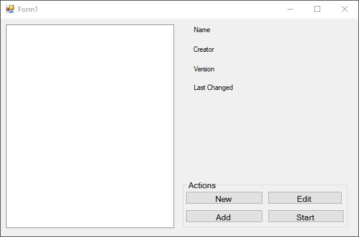
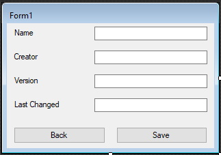
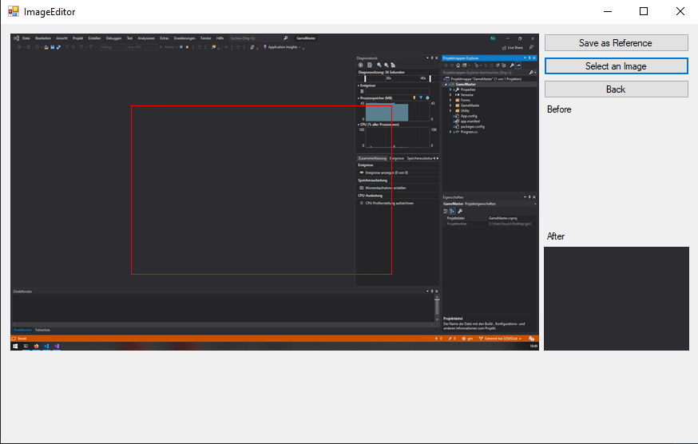

# Protokoll 'GameMaster'

*Informatik-Projekt von Jakob Wagner und Nick Lamprecht*

## Vorwort

Hier befindet sich das Stundentagebuch zu unserem Projekt. Zu unserer Projektseite geht es [hier](Projektseite.md).
Dieses Halbjahr ist aufgrund von einigen Stundenausfällen und der Einstellung des Unterrichtsbetriebes vor den Osterferien etwas anders gewesen. Wenn eine Informatikstunde ausgefallen ist, und wir am selben Tag noch weitergearbeitet haben, ist der Tag normal hier aufgeführt. Zusätzliche Daten sind Tage an denen wir zuhause einen größeren Fortschritt erzielt haben. Ansonsten sind kleinste Änderungen am nächsten Datum aufgeführt. 

## Stundenblog

### Dezember

#### 4. Dezember

Heute haben wir diskutiert, ob wir im zweiten Halbjahr weiter an 'Survisland' arbeiten, oder ein neues Projekt anfangen wollen. Schlußendlich haben wir uns für eine Anwendung entschieden, die in der Lage ist das Spielen von Computer- und Browsergames zu übernehmen. Wir haben die Anwendung den 'GameMaster' getauft.

#### 5. Dezember

Nachdem wir bereits den Rahmen für unser Projekt festgelegt hatten, ging es heute um die Details des Projekts. Wir wollen, dass der GameMaster vom Nutzer programmiert werden kann, um die Handlungen, die in einem beliebigen Spiel durchgeführt werden müssen, zu simulieren. Das Scripten soll dabei in einer grafischen Oberfläche stattfinden. Im Gegensatz zu klassichen Scripts / Bots soll der GameMaster nicht Input vom User voraussetzen oder Daten aus dem RAM auslesen, sondern anhand von Bildanalyse erkennen, was er tun muss. Die Konfigurationen nennen wir 'Ruleset'.
Für das UI werden wir Windows Forms verwenden.
Darüberhinaus haben wir heute das Repository und das Projekt für Visual Studio erstellt.

#### 10. Dezember

Heute haben wir mit dem User Interface begonnen. Die Anwendung hat einen Startbildschirm bekommen, in dem der Nutzer eine Liste von installierten Rulesets präsentiert bekommt und sich entscheiden kann, ob er ein neues Ruleset erstellen, ein vorhandenes starten oder bearbeiten möchte.

   


#### 11. Dezember

Auch heute haben wir noch am Interface der Anwendung gearbeitet und zum Beispiel das Fenster zum bearbeiten der Metadaten eines Rulesets erstellt.

   

#### 12. Dezember

Nachdem wir nun bereits einige Fenster erstellt haben, ging es heute darum einfache Funktionalitäten zu den Knöpfen hinzuzufügen, um so zum Beispiel von einem Fenster ins andere zu gelangen.
Außerdem haben wir ein neues Fenster hinzugefügt, dass das herunterladen von fertigen Rulesets erlaubt.

#### 19. Dezember

Heute haben wir an einige Fenster erstellt, mit denen man zu einem späteren Zeitpunkt die Eigenschaften von Objekten, die zu einem Ruleset hinzugefügt wurden, verändert werden können soll.

#### 14. Januar

Wir haben heute die Funktionalität der neuen Fenster eingebaut. Außerdem haben wir mit einer genauen Planung der Klassen-Struktur, die wir früher oder später brauchen werden, begonnen. 

#### 15. Januar

Wir arbeiteten heute parallel an der [Klasse, die die geladenen Rulesets repräsentiert](../GameMaster/Ruleset/Configuration.cs), und weiterer Funktionalität des User Interfaces.

#### 16. Januar

In der heutigen Informatikstunde haben wir hauptsächlich kleinere Fehler behoben. Anschließend haben wir uns mit der Hilfe von [PInvoke.net](http://www.pinvoke.net/) mit der Verwendung einiger Windows-Systembibliotheken auseinandergesetzt. Diese werden wir später zum Beispiel brauchen, um mit dem Prozess des Spiels interagieren zu können.

#### 22. Januar

Nachdem wir nun die meisten Bugs behoben hatte, haben wir heute sowohl etwas Code-Refactoring betrieben, als auch einige Verbesserungen am Hauptbildschirm durchgeführt.

#### 23. Januar

Heute haben wir eine Bibliothek namens [SUCC](https://github.com/JimmyCushnie/SUCC) eingebunden, mit der man sehr einfach Objekte serialisieren kann. Das Endresultat ist defacto eine YAML-Datei, auch wenn in diesem Fall die `.succ`-Erweiterung verwendet wird.

```yml
Name: Collector # Der Name des Rulesets. Kann auch der Name des Spiels sein.
Author: Nick # Der Ersteller des Rulesets.
ID: nick-collector # Die ID des Rulesets. Wir verwenden immer author-name um Konflikte zu vermeiden, wenn mehrere Rulesets für ein Spiel installiert sind.
Version: 1 # Die Version des Rulesets. Ist für eine Update-Funktionalität gedacht.
FriendlyVersion: 1.0.0 # Die Versionsnummer, die dem Nutzer angezeigt werden soll.
LastChanged: 2020-01-28 14:50:42 # Ein automatisch gesetzter Zeitstempel, wann das Ruleset zuletzt verändert wurde.
Categories: # Die Kategorien sind für einen erweiterten Ruleset-Browser gedacht.
    - Test Kategorie
    - Platformer
StartAction: C:\Users\buyin\source\repos\testgame\bin\Debug\TestGame.exe # Der Pfad zu der .exe, die vom GameMaster gestartet werden soll.
```
*Beispiel Ruleset*

Außerdem haben wir die Download-Funktionalität für Rulesets umgesetzt.

#### 28. & 29. Januar

An diesen Tagen haben wir das Speichern & Laden der `.succ`-Dateien eingebaut, sowie das Handling der Dateien bzw. Rulesets, die heruntergeladen wurden. 

#### 4. Februar

Wir haben eine Validierung der `StartAction` eingebaut, damit nur ausführbaere Dateien ausgewählt werden können. Außerdem verhindern wir, dass ein Ruleset gestartet werden kann, während bereits ein Ruleset ausgeführt wird. 

#### 5. Februar

Heute ging es um kleine UX Verbesserungen und darum, dass sich der Hauptbildschirm des GameMasters minimiert, wenn der Nutzer ein Ruleset startet. Und wenn die Prozess des Rulesets beendet wird, sollte der GameMaster sich natürlich wieder selbstständig öffnen.

#### 6. Februar

Heute haben wir etwas Code-Refactoring betrieben.

#### 12. Februar

#### 13. Februar

#### 14. Februar

#### 19. Februar

#### 20. Februar

Heute haben wir an einem neuen System gearbeitet, bei dem man, wenn man ein neues Ruleset erstellt, ein Template auswählen kann. Anhand dieses Templates werden dann schon Objekte zum Ruleset hinzugefügt (z.B. ein Player-Objekt). So muss man nur noch die passenden Werte (z.B. Referenzbilder, Farben, etc.) eintragen. Außerdem haben wir ein paar Änderungen am Layout des Interfaces vorgenommen.

#### 21. Feburar

Wir haben hauptsächlich die Funktionsweise des Editor-Fenster etwas überarbeitet. Darüber hinaus haben wir etwas an der Projektseite und am Overlay gearbeitet. 

#### 26., 27. & 28. Februar

In dieser Woche war Informatik ausgefallen. Wir haben dennoch an einem Logging-System gearbeitet, mit dem Nachrichten von der Anwendung selbst als auch vom konfigurierten Ruleset sowohl in eine Log-Datei als auch auf dem Overlay geschrieben werden können.

#### 6. März

Wir sind heute für das Speichern der Rulesets von der SUCC Library, die wir bisher verwendet haben, auf den .NET XML-Serializer umgestiegen. Diese Lösung ist zwar auch nicht optimal, da wir jetzt für jede Klasse, die der Nutzer verwenden **könnte** eine extra Zeile schreiben müssen (und das jetzt schon absurd aussieht), allerdings ist das System jetzt robuster und bereitet langfristig weniger Probleme.

```c#
[...]
namespace GameMaster.Ruleset
{
    [XmlRoot("configuration")]
    [XmlInclude(typeof(Templates.Template2D))]
    [XmlInclude(typeof(Templates.Platformer))]
    [XmlInclude(typeof(Events.CustomGlobalEvent))]
    [XmlInclude(typeof(Events.CustomWorldEvent))]
    [XmlInclude(typeof(Events.WorldShutdownRequestEvent))]
    [XmlInclude(typeof(Events.GlobalShutdownRequestEvent))]
    [XmlInclude(typeof(Events.TickEvent))]
    [XmlInclude(typeof(Events.WorldStartupEvent))]
    [XmlInclude(typeof(Actions.Avoid))]
    [XmlInclude(typeof(Actions.Click))]
    [XmlInclude(typeof(Actions.ExecuteCustomEvent))]
    [XmlInclude(typeof(Actions.Log))]
    [XmlInclude(typeof(Actions.Move))]
    [XmlInclude(typeof(Actions.OverlayLog))]
    [XmlInclude(typeof(Worlds.GameWorld))]
    [XmlInclude(typeof(Worlds.StartupWorld))]
    public class Configuration
    { [...]
```
*[Configuration.cs](GameMaster/Ruleset/Configuration.cs)*

Die gespeicherten Konfigurationen sehen leider nicht mehr so übersichtlich aus, lassen sich aber dennoch verstehen.

```xml
<?xml version="1.0" encoding="utf-8"?>
<configuration xmlns:xsd="http://www.w3.org/2001/XMLSchema" xmlns:xsi="http://www.w3.org/2001/XMLSchema-instance">
  <Name>Game Master Test Game Configuration</Name>
  <ID>collector</ID>
  <Executable>C:\Users\buyin\source\repos\testgame\bin\Debug\TestGame.exe</Executable>
  <Template xsi:type="Platformer">
    <Name>Platformer</Name>
  </Template>
  <CustomEvents />
  <LeftSideObjects>
    <LeftSide xsi:type="TickEvent">
      <Name>Tick Event</Name>
      <Description>This event is triggered after a set amount of miliseconds. Useful for recurring actions. Timeframe can be changed in the template settings.</Description>
      <EventObjects>
        <RightSide xsi:type="OverlayLog">
          <Name>Overlay Log</Name>
        </RightSide>
      </EventObjects>
    </LeftSide>
  </LeftSideObjects>
</configuration>
```
*Rulesets als XML*

#### 7. März

Heute haben wir uns um Keyboard-Hooks gekümmert. Da sich der GameMaster minimiert sobald ein Ruleset ausgeführt wird, ist es für uns wichtig mithilfe der User32.dll uns in die Keyboard-Events einzuhaken. So können wir, obwohl das Fenster des geladenen Spiels fokussiert ist, einige Tastenkombinationen erst zum GameMaster umleiten. So haben wir z.B. auf `Strg + F3` ein sofortiges Beenden des Spiels eingebaut.

#### 8. März

Heute haben wir einiges überarbeitet. So verwenden wir im Editor nicht mehr einfache Listen sondern ein Tree-View mit denen sich besser die hierarchischen Strukturen innerhalb eines Rulesets darstellen lassen. Außerdem haben wir die Events so verändert, dass nicht mehr zwischen globalen und lokalen Events unterschieden wird, sondern nur noch ein Eventtyp vorhanden ist. Anschließend haben wir mithilfe der neuen Keyboard-Hooks die Kombination `Strg + F4` zur Erstellen von Screenshots für die Verwendung als Referenzbild eingebaut. Leider sind es bislang nur richtige Screenshots. Eigentlich sollte unter Verwendung der Windows-Bibliotheken ein Abbild des Subprozesses allein erstellt werden, das hat allerdings bislang nicht geklappt.

#### 9. März

Wir haben ein neues Fenster für das Cropping-Tool angelegt. In diesem Fenster soll der Nutzer ein Screenshot laden können, den er während einer GameMaster-Session erstellt hat, und mithilfe der Maus einen Bereich festlegen, der dann als Referenz gespeichert wird. So kann man in einem Screenshot von unserem `Collector`-Testspiel das hellbalue Viereck des Spielers auswählen und der GameMaster speichert dann diesen einzelnen Bereich als neue Bitmap ab, die dann später verwendet wird.

Außerdem haben wir den Logging-Mechanismus überarbeitet und eine Dialogfenster für die Auswahl der `.exe` des Spiels hinzugefügt.

#### 11. März

In der heutigen Stunde haben wir weiter am Cropping-Tool gearbeitet. Es gibt noch einen Fehler, bei dem das neue Referenzbild die falsche Größe hat. Diesen konnten wir bislang nicht beheben.

   


#### 12. März

Heute haben wir den Bug im Cropping-Tool endlich behben können. Anschließend haben wir die Elemente des Interfaces, die wir zum Debuggen verwendet haben, entfernt.

#### 13. März

Auch heute haben wir noch einige kleine Änderungen am Cropping-Tool vorgenommen. Obwohl es immer noch nicht ganz fertig ist, widmen wir uns in den nächsten Wochen bis zur Abgabe nur der Bildanalyse und der Interaktion mit dem Prozess des Spiels.

#### 23. März

Heute haben wir den Stundenblog finalisiert.